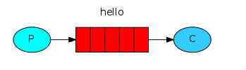
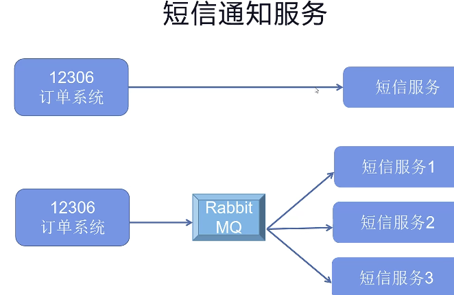
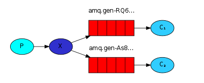
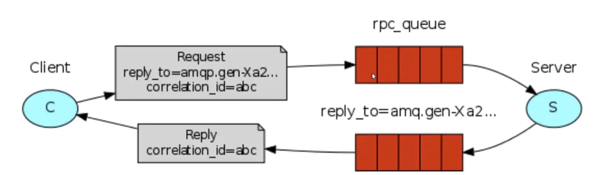

# 基本组件概念

- **Producer**：消息的提供者。
- **Consumer**：消息的消费者。
- **Broker**：MQ服务器，管理队列、消息以及相关的信息。
- **Message**：消息，程序间通信的数据。
- **Queue**：队列，消息存放的容器，FIFO队列。
- **Exchange**：交换机，用于分发消息。

# 队列模式及其应用场景

RabbitMQ一共有六种队列模式

## simple简单模式

###  说明

1. 消息的生产者将消息放入队列中。
2. 消费者监听消息队列，有消息来就取走消费，没有就继续监听等待，这个取走的过程会从队列中删除消息，这样也是一个安全隐患，可**能出现消费者没正确消费，但是没法再次获得此消息的问题。**

### 应用场景

1. 聊天消息。

## work工作模式（资源的竞争）

### 说明

生产者将消息放入队列，该消息队列可以有多个消费者，谁先拿到消息谁就先去消费，但是也有安全隐患，在高并发环境下，我们都会去认为存在一个消息被多个消费者共同使用的情况，也就是重复消费。

类比于负载均衡模式。

### 应用场景

1. 抢红包。
2. 大项目中的资源调度（任务分配系统不知道哪一个任务执行系统在空闲，直接将任务扔到消息队列中，空闲的系统会自己来拿）。
3. 集群环境中做异步处理，高并发情况下可能会出现消息堆积，你只需要水平扩充消费者数量。

## publish/subscribe发布订阅模式（共享资源）

### 说明

1. **X**代表RabbitMQ提供的虚拟交换机。
2. 交换机会将当前消息的副本分发到所有消息队列中去。

### 应用场景

- 大规模数据分发场景。

- 比如气象局将天气预报放入交换机，不同 APP 门户接入通过消息队列绑定到该交换机，自动获取气象局推送的气象数据。
- 不适合有条件的订阅。

## routing路由模式

### 说明

- 路由模式是发布订阅模式的变种。
- 发布订阅模式是无条件将所有消息送到所有消费者对应的消费队列中。
- 路由模式则是**交换机根据指定的路由key有条件的将消息筛选法如对应的消费队列**。
- 它是**精准匹配**。

### 应用场景

- 比如什么vip板块消息推送之类的。
- 错误通知功能啦。

## topic 主题模式(路由模式的一种)

### 说明

- 在原有的路由模式上新增通配符。
- 可以**通过通配符同时匹配一个或者多个满足条件的队列**。
- 消息的分发更加灵活。
- ***代表匹配单个关键字、#代表匹配所有关键字**。

### 应用场景

- 可以灵活解决我们路由模式的一些不灵活之处，细化消息推送。

## RPC同步通信

### 说明

我们之前所提到的模式，大多都是异步，也就是说，消息一旦推送，生产者就不管接下来的结果了。

但是我们有时候不能满足要求，很多时候我们需要得到消费者消费得到的结果，这时候就得要RPC模式，上面图中的闭环会引起客户端和服务端阻塞，实现了同步通信。