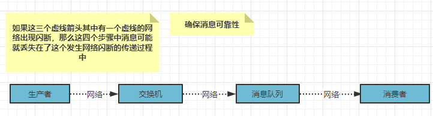
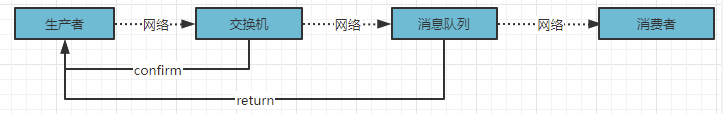

# RabbitMQ 灵魂三问

**如果消息已经到达了 RabbitMQ，但是 RabbitMQ 服务器宕机了，消息是不是就丢失了？**

- RabbitMQ 的 Queue 有消息持久化机制。

**消费者在消费时，如果执行一半，消费者宕机导致消费失败怎么办？**

- RabbitMQ 的手动 ACK。

**生产者发送消息时，由于网络问题，导致消息没有发送到 RabbitMQ 怎么办？**

- RabbitMQ 提供了事务操作，和 Confirm。

# 手动ACK

**为啥需要手动ACK捏？**

我们执行一个任务可能需要花费几秒钟，你可能会去担心如果一个消费者再执行任务的过程中挂掉了。一旦 **RabbitMQ** 将消息分发给了消费者，就会从内存中删除。在这种情况下，如果正在执行任务的消费者宕机，会丢失正在处理的消息和分发给这个消费者但尚未处理的消息。

但是，如果我们不想丢失任何任务，如果有一个消费者挂掉了，那么我们应该将分发给他们的任务交付给另一个消费者去处理。

为了确保消息不会丢失，**RabbitMQ** 支持消息应答。消费者发送一个消息应答，告诉 **RabbitMQ** 这个消息已经接收并且已经处理完毕了，**RabbitMQ** 才会去删除它。

如果一个消息由于消费者挂掉了 **RabbitMQ** 服务器没收到应答，**RabbitMQ** 会理解为这个消息没有处理完成，然后交给另一个消费者去重新处理。这样，你就可以确认即使消费者偶尔挂掉也不会丢失任何消息。

没有任何消息超时限制，只有当消费者挂掉的时候，**RabbitMQ** 才会重新投递。即使处理一条消息会花费很长时间。

# 消息可靠性

**RabbitMQ的事务**：事务可以保证消息100%传递，可以通过事务的回滚去记录日志，后面定时再发送当前消息。

但是！

事务的操作，效率太低，加了事务操作后，比平时的操作效率至少要慢100倍。  

**rabbitMQ提供了两个机制，confirm机制确保消息到达交换机，return机制确保消息到达队列。**

## 消息丢失



我们此时可不可以设计一个机制，去避免这种消息丢失带来的后果呢？

我们可以尝试在这四个对象之间设置一种通信，如果消息到达某个对象，那么这个对象就发送一个确认消息说我收到了，比如交换机收到生产者的消息之后，发送确认信号给生产者告知生产者我收到了你的消息。

消息队列告诉交换机、交换机再告诉生产者，或者消息队列直接告诉生产者。这些都不好说，而且有了这种机制，我们也得有补偿机制，补偿丢失消息，重发消息之类的。

**RabbitMQ除了事务，还提供了Confirm的确认机制，这个效率比事务高很多。**

## 普通Confirm方式

- **单一确认**

```java
// 开启confirm
channel.confirmSelect();
// 发送消息
String message = "hello";
channel.basicPublish("", "hello", null, message.getBytes());
// 确认是否发送成功
if (channel.waitForConfirms()) {
    System.out.print("消息发送到交换机");
} else {
    System.out.print("消息发送失败");
}
```

- **批量确认**

```java
// 开启confirm
channel.confirmSelect();
// 发送消息
for (int i = 0; i < 100; i ++) {
    String msg = "hello!" + i;
    channel.basicPublish("", "hello", null, msg.getBytes());
}
// 确认批量操作是否成功，当你发送的批量消息中有一个失败，就全部失败，抛出IO异常
channel.waitForConfirmsOrDie();
```

- **异步确认**

```java
// 开启confirm
channel.confirmSelect();
// 批量发送消息
for (int i = 0; i < 100; i ++) {
    String msg = "hello" + i;
    channel.basicPublish("", "hello", null, msg.getByte());
}
// 异步回调
channel.addConfirmListener(new ConfirmListener() {
    @Override
    public void handleAck(long deliveryTag, boolean multiple) throws IOException {
        System.out.print("消息发送到交换机，标识：" + deliveryTag + "是否批量" + multiple);
    }
    
    @Override
    public void handleNAck(long deliveryTag, boolean multiple) throws IOException {
        System.out.print("消息发送失败，标识：" + deliveryTag + "是否批量" + multiple);
    }
})
```

## Return 机制

**Confirm机制**只能保证消息到达**交换机Exchange**，无法保证我们消息可以被交换机分发到指定的队列，所以这种时候我们需要一种机制来告诉我们的生产者消息是否被正确传输，因为我们的交换机是没有办法进行消息持久化的，而我们的**queue**是可以消息持久化的。

**RabbitMQ** 提供 **Return** 机制来监听消息是否从交换机中传送到了指定的队列之中。



```java
// 开启return机制
channel.addReturnListener(new ReturnListener() {
    // 当前消息没有到达队列才会触发
    @Override
    public void handleReturn(int reply Code, String replyText, String exchange, String routingKey, AMQP.BasicProperties properties, byte[] body) throws IOException {
        System.out.print(new String(body, "UTF-8") + "消息没有送到队列中");
    }
})
// 在发送消息时，指定mandatory参数为true
channel.basicPublish("", "hello", true, null, msg.getBytes());
```

