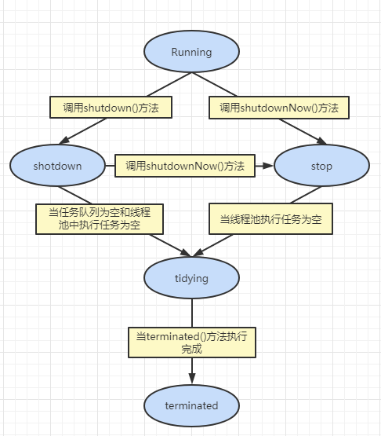

#  线程池详解


## FutureTask详解

- **Future** 表示了一个任务的生命周期，是一个可取消的异步运算。
- 可以把它看作是一个异步操作的结果的占位符。
- 他将在未来的某个时刻完成，并提供对其结果的访问。
- 并发包中许多异步任务类都继承自 **Future**，最典型的就属 **FutureTask** 了。


## 线程池的体系结构

从 JDK5 开始，工作单元和执行机制被分离开来了，工作单元包括了 **Runnable** 和 **Callable**，而执行机制由 **Executor** 框架提供。

```java
/*
    |_ java.util.concurrent.ExecutorS：线程池工具类，快速获取线程池
    |_ java.util.concurrent.Executor：线程池顶级接口，定义了最基本的执行方法
        |_ java.util.concurrent.ExecutorService：继承 Executor 接口，提供线程池的基本常用操作
            |_ java.util.concurrent.ThreadPollExecutor：实现 ExecutorService 接口，线程池核心实现类
           	 	|_ java.util.concurrent.ScheduledThreadPollExecutor：可调度的线程池
*/
```

我们一般都是调用 **ThreadPoolExecutor** 类 来创建一个线程池。

```java
public static void main(String[] args) {
    ExecutorService threadPool = new ThreadPoolExecutor();
    threadPool.executor(任务);
}
```


## ThreadPoolExecutor类详解


### 示例一：用 Executors 创建

先看一个例子，这个例子是调用 Executors 工具类来创建的线程池。

```java
// 资源
class WorkerThread implements Runnable {

    // 命令及其构造函数
    private String command;
    public WorkerThread(String command) {
        this.command = command;
    }
    
    // 执行命令
    private void processCommand() {
        try {
            Thread.sleep(1000);
        } catch (InterruptedException e) {
            e.printStackTrace();
        }
    }

    @Override
    public void run() {
        System.out.println(Thread.currentThread().getName() + "线程\t 开始执行command = " + this.command);
        this.processCommand();
        System.out.println(Thread.currentThread().getName() + "线程\t 执行完毕");

    }

    @Override
    public String toString() {
        return "WorkerThread{" +
                "command='" + command + '\'' +
                '}';
    }
}
```

```java
// 测试类
public class ThreadPoolDemo02 {
    public static void main(String[] args) {
        ExecutorService threadPool = Executors.newFixedThreadPool(5);
        for (int i = 0; i < 10; i++) {

            threadPool.execute(new WorkerThread("" + i));
        }
        // 关闭线程池
        threadPool.shutdown();
        // 检查线程池是否被终结
        while (!threadPool.isTerminated()) {}
        System.out.println("所有线程均结束");
    }
}

```

```java
/*
    pool-1-thread-1线程	 开始执行command = 0
    pool-1-thread-5线程	 开始执行command = 4
    pool-1-thread-3线程	 开始执行command = 2
    pool-1-thread-4线程	 开始执行command = 3
    pool-1-thread-2线程	 开始执行command = 1
    pool-1-thread-5线程	 执行完毕
    pool-1-thread-2线程	 执行完毕
    pool-1-thread-4线程	 执行完毕
    pool-1-thread-3线程	 执行完毕
    pool-1-thread-1线程	 执行完毕
    pool-1-thread-1线程	 开始执行command = 9
    pool-1-thread-3线程	 开始执行command = 8
    pool-1-thread-4线程	 开始执行command = 7
    pool-1-thread-2线程	 开始执行command = 6
    pool-1-thread-5线程	 开始执行command = 5
    pool-1-thread-2线程	 执行完毕
    pool-1-thread-1线程	 执行完毕
    pool-1-thread-4线程	 执行完毕
    pool-1-thread-5线程	 执行完毕
    pool-1-thread-3线程	 执行完毕
    所有线程均结束
*/
```

我们不难发现==虽然是十个任务，但是我们一直在用五个进程去完成他们==。**因为线程池大小为五**，它将启动五个工作线程先处理五个工作，其他的工作则处于等待状态，一旦有工作完成，空闲下来工作线程就会捡取等待队列里的其他工作进行执行。

同时我们也可以看出，五个线程并**不会随着第一波任务做完而被销毁，而是一直存在等待新的任务，直到线程池被销毁**。


### 示例二：自定义线程池

ThreadPoolExecutor 提供了一些方法，我们可以用这些方法来查看 executor 的**当前状态**，**线程池大小**，**活动线程数量**，**任务数量**等数据，因此我们可以**自定义一个监听线程来定时查看线程池的信息。**

```java
// 监听线程
class MyMonitorThread implements Runnable {
    // 要监听的线程池
    private ThreadPoolExecutor executor;
    // 当前检测延迟
    private int second;
    // 当前监视器是否停止
    private boolean hasRun = true;
    
    public MyMonitorThread(ThreadPoolExecutor executor, int delay) {
        this.executor = executor;
        this.second = delay;
    }
    
    public void shutdown() {
        this.hasRun = false;
    }

    @Override
    public void run() {
        while (hasRun) {
            System.out.println(
                    String.format("[monitor] [%d/%d] Active: %d, Completed: %d, Task: %d, isShutdown: %s, isTerminated: %s",
                    this.executor.getPoolSize(), // 线程池大小
                    this.executor.getCorePoolSize(), // 线程池核心线程数
                    this.executor.getActiveCount(), // 运行中线程数
                    this.executor.getCompletedTaskCount(), // 完成任务数
                    this.executor.getTaskCount(), // 任务总数
                    this.executor.isShutdown(), // 是否关闭
                    this.executor.isTerminated()) // 是否销毁
            );

            // 休眠延迟
            try {
                Thread.sleep(second * 1000);
            } catch (InterruptedException e) {
                e.printStackTrace();
            }
        }
    }
}
```

```java
// 自定义拒绝策略
class RejectedExecutionHandlerImpl implements RejectedExecutionHandler {
    @Override
    public void rejectedExecution(Runnable r, ThreadPoolExecutor executor) {
        System.out.println(r.toString() + " is rejected");
    }
}
```

```java
public class ThreadPoolDemo03 {
    public static void main(String[] args) throws InterruptedException{
        // 创建拒绝策略
        RejectedExecutionHandlerImpl rejectedHandler = new RejectedExecutionHandlerImpl();
        // 默认线程工程
        ThreadFactory threadFactory = Executors.defaultThreadFactory();
        // 线程池创建
        ThreadPoolExecutor threadPoolExecutor = new ThreadPoolExecutor(2, 4,
                10, TimeUnit.SECONDS,
                new ArrayBlockingQueue<Runnable>(2),
                threadFactory,
                rejectedHandler);

        // 创建监听这个myMonitorThread线程池的监听线程，延迟是3秒，并启动
        MyMonitorThread monitor = new MyMonitorThread(threadPoolExecutor, 3);
        Thread monitorThread = new Thread(monitor);
        monitorThread.start();

        // 启动线程池
        for (int i = 0; i < 10; i++) {
            threadPoolExecutor.execute(new WorkerThread("cmd" + i));
        }

        // 主线程休息三十秒
        try {
            TimeUnit.SECONDS.sleep(10);
        } catch (InterruptedException e) {
            e.printStackTrace();
        }
        // 关闭线程池
        threadPoolExecutor.shutdown();
        // 主线程休息五秒
        try {
            TimeUnit.SECONDS.sleep(5);
        } catch (InterruptedException e) {
            e.printStackTrace();
        }
        // 关闭监听线程
        monitor.shutdown();
    }
}
```

```java
/*
    pool-1-thread-1线程	 开始执行command = cmd0
    pool-1-thread-3线程	 开始执行command = cmd4
    WorkerThread{command='cmd6'} is rejected
    pool-1-thread-2线程	 开始执行command = cmd1
    WorkerThread{command='cmd7'} is rejected
    pool-1-thread-4线程	 开始执行command = cmd5
    WorkerThread{command='cmd8'} is rejected
    WorkerThread{command='cmd9'} is rejected
    [monitor] [0/2] Active: 0, Completed: 0, Task: 1, isShutdown: false, isTerminated: false
    pool-1-thread-4线程	 执行完毕
    pool-1-thread-1线程	 执行完毕
    pool-1-thread-3线程	 执行完毕
    pool-1-thread-2线程	 执行完毕
    pool-1-thread-3线程	 开始执行command = cmd3
    pool-1-thread-4线程	 开始执行command = cmd2
    pool-1-thread-4线程	 执行完毕
    pool-1-thread-3线程	 执行完毕
    [monitor] [4/2] Active: 0, Completed: 6, Task: 6, isShutdown: false, isTerminated: false
    [monitor] [4/2] Active: 0, Completed: 6, Task: 6, isShutdown: false, isTerminated: false
    [monitor] [4/2] Active: 0, Completed: 6, Task: 6, isShutdown: false, isTerminated: false
    [monitor] [2/2] Active: 0, Completed: 6, Task: 6, isShutdown: false, isTerminated: false
    [monitor] [2/2] Active: 0, Completed: 6, Task: 6, isShutdown: false, isTerminated: false
    [monitor] [2/2] Active: 0, Completed: 6, Task: 6, isShutdown: false, isTerminated: false
    [monitor] [2/2] Active: 0, Completed: 6, Task: 6, isShutdown: false, isTerminated: false
    [monitor] [2/2] Active: 0, Completed: 6, Task: 6, isShutdown: false, isTerminated: false
    [monitor] [2/2] Active: 0, Completed: 6, Task: 6, isShutdown: false, isTerminated: false
    [monitor] [0/2] Active: 0, Completed: 6, Task: 6, isShutdown: true, isTerminated: true
    [monitor] [0/2] Active: 0, Completed: 6, Task: 6, isShutdown: true, isTerminated: true
*/
```

从运行结果，我们可以看出**完整的线程池的工作流程**，它与我在线程池那笔记里的运行流程是一样的，所以具体的执行过程我就不在这里赘述了。


### 关闭线程池

关闭线程池有两种方法：

- shutdown：
  - 将线程池里的线程状态设置为 **SHUTDOWN** 状态。
  - 中断**所有不在工作状态**的线程。
- shutdownNow：
  - 将线程池中所有线程的状态设置为 **STOP** 状态。
  - 停止所有**正在执行任务的线程**或**暂时暂停任务执行的线程**。

只要**调用这两个关闭方法**中的**任意一个**， **isShutDown()** 方法返回 **true**，当所有线程都成功停止执行任务了，**isTerminated()** 方法 返回 **true**，届时，线程池就算成功关闭。


### 几个重要属性

```java

// 这个属性尤为重要是用来存放 当前运行的核心线程数量以及线程池状态的
// int是32位的，这里把int的 高3位 拿来充当线程池状态的标志位，后29位 拿来充当当前运行的核心线程的数量
private final AtomicInteger ctl = new AtomicInteger(ctlOf(RUNNING, 0));
// 存放任务的阻塞队列
private final BlockingQueue<Runnable> workQueue;
// 存放核心线程的集合，用set来存放，保证不重复
private final HashSet<Worker> workers = new HashSet<Worker>();
// 历史达到的最大 worker 数量
// worker 即核心线程
private int largestPoolSize;
// 当队列满了并且当前线程池中核心线程的数量达到 maxSize 的时候，要执行的具体的拒绝策略
// 可见性，禁止指令重排
private volatile RejectedExecutionHandler handler;
// 超出 coreSize 的临时核心线程的生存时间
// 可见性，禁止指令重排
private volatile long keepAliveTime;
// 常驻核心线程的数量
// 可见性，禁止指令重排
private volatile int corePoolSize;
// 线程池最大容纳的核心线程数量，一般当任务队列满了才会用到这个参数
// 可见性，禁止指令重排
private volatile int maximumPoolSize;
```


### 内部状态

```java
// int总共32位，高3位表示线程池的状态，后29位表示线程池中线程数量
private final AtomicInteger ctl = new AtomicInteger(ctlOf(RUNNING, 0));
private static final int COUNT_BITS = Integer.SIZE - 3; // 32 - 3 = 29
private static final int CAPACITY   = (1 << COUNT_BITS) - 1; // 最多可以有个536870911线程

// 高3位表示的状态
private static final int RUNNING    = -1 << COUNT_BITS; // 111 表示线程池正在运行，会持续接受任务，并处理阻塞队列中的任务
private static final int SHUTDOWN   =  0 << COUNT_BITS; // 000 表示线程池不会接收新任务，但会处理阻塞队列中剩下的任务
private static final int STOP       =  1 << COUNT_BITS; // 001 表示线程池不会接收新任务，不会处理阻塞队列中的任务，中断正在进行的任务
private static final int TIDYING    =  2 << COUNT_BITS; // 010 表示线程池中所有任务已经终止
private static final int TERMINATED =  3 << COUNT_BITS; // 011 表示线程池关闭，terminated()方法已经执行完成

// ctl变量的打包和拆包
private static int runStateOf(int c)     { return c & ~CAPACITY; } // 将ctl的值，取 高3位 的数值，即取状态，拆包状态
private static int workerCountOf(int c)  { return c & CAPACITY; } // 将ctl的值 ，取低29位的值，即线程池容量，拆包容量
private static int ctlOf(int rs, int wc) { return rs | wc; } //传入rs（状态）和wc(线程池容量)，取得对应的ctl，打包
```

|  |
| :----------------------------------------------------------: |
|                           **图示**                           |


### 任务的执行

execute --> addWorker --> runworker(getTast)

线程池的工作线程通过 **Woker类** 实现。在 ReentrantLock 锁的保证下，把 **Worker** 的实例插入到 **HashSet** 中后，启动 **Worker** 中的线程。

 

### Worker内部类

从 **Woker类** 的**构造方法**实现可以发现，线程工厂在创建线程 **thread** 时，将 **Woker**实例本身 **this** 作为参数传入，当执行 **start** 方法启动线程 **thread** 时，本质是执行了 **Worker** 的 **runWorker** 方法。 **firstTask** 执行完成之后，通过 **getTask** 方法**从阻塞队列中获取等待的任务**，**如果队列中没有任务，getTask方法会被阻塞并挂起，不会占用cpu资源；**

```java
    private final class Worker
        extends AbstractQueuedSynchronizer
        implements Runnable
    {
        private static final long serialVersionUID = 6138294804551838833L;

        // 这个worker正在运行的线程，如果没有工厂则为空 
        final Thread thread;
        // 当一个worker刚创建的时候，就先尝试执行这个任务，可能为空
        Runnable firstTask;
        // 当前线程任务计数器
        volatile long completedTasks;

        Worker(Runnable firstTask) {
            setState(-1); // 禁止在任务执行前对当前线程进行中断，因为 tryAcquire方法是根据 state 是否为 0 来判断的
            this.firstTask = firstTask;
            this.thread = getThreadFactory().newThread(this);  // 创建线程
        }
        
        // ... 暂时不看下面的
    }
```

#### runWorker方法（核心）

大体流程：

- **while循环**来调用**getTask方法**来不断**获取任务**
- **getTask**方法**从阻塞队列中获取任务**
- 如果此时线程池**正在停止**
  - 要保证当前线程是不是中断状态，是的话不能执行任务，中断当前线程
  - 不是的话，可以执行任务
- 调用 **task.run 方法来执行任务** 
- 如果**没取到任务**，那么执行 **processWorkerExit()** 方法
- **runworker方法 执行完毕**代表着 **Worker** 的 **run** 方法**执行完毕**

```java
final void runWorker(Worker w) {
    Thread wt = Thread.currentThread();
    Runnable task = w.firstTask; //获取第一个任务
    w.firstTask = null; 
    w.unlock(); // 通过unlock方法释放锁，设置AQS的state为0，表示运行可中断
    
    // 是否因为异常退出循环
    boolean completedAbruptly = true;
    // 任务如果未被完整执行，出现异常
    try {
        // 这里就是为什么线程能被复用的重点
        // 如果task为空，则通过getTask来获取任务，然后执行任务
        // 添加worker时可能添加没有task任务的worker
        while (task != null || (task = getTask()) != null) {
            // 执行任务前先锁住,这里主要的作用就是给shutdown方法判断worker是否在执行中的
            // shutdown方法里面会尝试给这个线程加锁,如果这个线程在执行,就不会中断它
            w.lock();
            // 如果线程池正在停止，确保当前线程是中断状态
            // 如果不是，则保证当前线程不是中断状态并且继续执行任务
            // 这里主要是对 worker 线程中断的处理逻辑
            if ((runStateAtLeast(ctl.get(), STOP) ||
                 (Thread.interrupted() &&
                  runStateAtLeast(ctl.get(), STOP))) &&
                !wt.isInterrupted())
                wt.interrupt();
            try {
                beforeExecute(wt, task);
                Throwable thrown = null;
                try {
                    task.run();// 执行任务
                } catch (RuntimeException x) {
                    thrown = x; throw x;
                } catch (Error x) {
                    thrown = x; throw x;
                } catch (Throwable x) {
                    thrown = x; throw new Error(x);
                } finally {
                    afterExecute(task, thrown);
                }
            } finally {
                task = null;
                w.completedTasks++;
                w.unlock();
            }
        }
        completedAbruptly = false;
    } finally {
        // 这个善后方法一般有这些作用
        // 终止线程池时，用于从线程集合中移除工作线程；
        // 当前线程因为异常而退出，重新创建线程替换之；
        // 线程池中因为设置允许核心线程超时allowCoreThreadTimeOut=true，导致工作线程全部被回收时，任务队列仍然有任务，则新建线程；
        processWorkerExit(w, completedAbruptly);
    }
}
```

#### getTask方法（核心）

- 从队列里获取任务的方法，如果任务队列为空，会在此处进行阻塞。
- 其中最重要的就是**第二个if判断**，这个**if判断**就对应着我们**线程池工作流程**中的对于**添加的临时核心线程的生命周期的控制**。

```java
private Runnable getTask() {
    // 表示上次从阻塞队列中取任务是否超时
    // Did the last poll() time out?
    boolean timedOut = false; 

    for (;;) {
        int c = ctl.get();
        int rs = runStateOf(c);

        // 线程池状态是stop或以后。状态为shutdown且队列为空。
        // 在以上两个情况下，worker数量减一后推出
        // 因为如果当前线程池的状态是 shutdown 及以上的话，是不允许再向阻塞队列中添加任务的。
        // 在必要时检查队列是否为空
        if (rs >= SHUTDOWN && (rs >= STOP || workQueue.isEmpty())) {
            decrementWorkerCount();
            return null;
        }

        // 获取当前正在运行中的worker数量
        int wc = workerCountOf(c);

        // 是否进行超时控制
        // 超过线程池常驻核心线程数量之后，或者，允许常驻核心线程超时的时候，都一定会开启        
        // allowCoreThreadTimeOut默认为false，也就是常驻核心线程不允许进行超时
        // wc > corePoolSize，表示当前线程池中的总线程数量大于常驻核心线程数量
        boolean timed = allowCoreThreadTimeOut || wc > corePoolSize;
        // 超时控制被触发，会将当前核心线程数量减一，返回空；触发失败重新循环判断。
        // 触发标准，（1||2）&&（3||4）
        // 1、worker数量大于最大线程池数量
        // 2、进行超时控制并且上次获取任务发生了超时
        // 3、worker数量大于1
        // 4、任务队列为空
        if ((wc > maximumPoolSize || (timed && timedOut))
            && (wc > 1 || workQueue.isEmpty())) {
            // cas 操作移除一个线程
            if (compareAndDecrementWorkerCount(c))
                return null;
            continue;
        }
        // 超时控制时，若获取任务超时则设置 timedOut = true
        // 以下逻辑是阻塞队列获取任务
        try {
            // 临时核心线程，一般都得用poll超时组获取任务，因为涉及到临时线程的销毁
            // 而常驻核心线程，一般用take阻塞组获取任务，因为常驻核心线程得在线程池存在时一直被复用或等待
            // 根据timed来判断，如果为true，则通过阻塞队列的poll方法进行超时控制，如果在keepAliveTime时间内没有获取到任务，则返回null
            // 否则通过take方法，如果此时队列为空，则take方法会阻塞到队列不为空，这里就是阻塞队列中的超时组和阻塞组的使用。
            Runnable r = timed ?
                workQueue.poll(keepAliveTime, TimeUnit.NANOSECONDS) :
            workQueue.take();
            if (r != null)
                return r;
            timedOut = true; // 若特定时间获取不到任务，判定为超时。
        } catch (InterruptedException retry) {
            timedOut = false;
        }
    }
}
```

#### processWorkerExit 方法

- 执行工作线程销毁

```java
private void processWorkerExit(Worker w, boolean completedAbruptly) {
    // completedAbruptly的值在 runworker 方法中被支配
    // 如果 completedAbruptly 值为true，则说明线程执行时出现了异常，需要将workerCount减1；
    // 如果线程执行时没有出现异常，说明在getTask()方法中已经已经对workerCount进行了减1操作，这里就不必再减了。  
    if (completedAbruptly) // If abrupt, then workerCount wasn't adjusted
        decrementWorkerCount();
    final ReentrantLock mainLock = this.mainLock;
    mainLock.lock();
    try {
        // 统计当前线程完成的任务数
        completedTaskCount += w.completedTasks;
        // 从workers的set中移除当前线程，也就表示着从线程池中移除了一个工作线程
        workers.remove(w);
    } finally {
        // 整个过程加独占锁，不能被打扰
        mainLock.unlock();
    }
    
    // 根据线程池状态进行判断是否结束线程池
    tryTerminate();
    int c = ctl.get();

    // 当线程池是RUNNING或SHUTDOWN状态也就是状态值小于STOP的状态值，
    // 如果worker是异常结束，那么会直接addWorker
    // 如果不是异常结束，就判断是否允许超时控制并且任务队列是否还有任务，有的话，最少保证还有一个工作线程
    // 或者此时线程池中的工作线程的数量是否大于要求的最小值，是的话就不用添加线程直接退出
    if (runStateLessThan(c, STOP)) {
        if (!completedAbruptly) {
            
            int min = allowCoreThreadTimeOut ? 0 : corePoolSize;
            if (min == 0 && ! workQueue.isEmpty())
                min = 1;
            if (workerCountOf(c) >= min)
                return; // replacement not needed
        }
        addWorker(null, false);
    }
}
```


### execute方法

如果线程池状态一直是 **RUNNING** 的话，执行流程大致如下：

- 活动**线程数小于线程池容量**，也就是说**常驻核心线程数**还没到**该线程池**设置的 **corePoolSize** 的话，创建**新的常驻核心线程**去执行**当前任务**。
- 否则就将此时的任务扔到阻塞队列中去排队等待。
- 否则如果此时**常驻核心线程数**到了，并且没超过**当前线程池最大核心线程容量**，**阻塞队列还满了**，就**创建临时核心线程**去执行任务。
- 否则就是调用拒绝策略了。

```java
public void execute(Runnable command) {
    if (command == null)
        throw new NullPointerException();
    // 获取当前工作线程状态
    int c = ctl.get();
    // 判断当前线程池中活动线程数是否小于线程池容量，是的话就创建常驻核心线程
    if (workerCountOf(c) < corePoolSize) {  
    // 执行 addWorker方法 创建新的常驻核心线程执行 command 任务
       if (addWorker(command, true))
            return;
        // 如果添加失败，再次获取当前工作线程状态
        c = ctl.get();
    }
    // 双重检查线程池状态
    // 线程池处于RUNNING状态，把提交的任务成功放入阻塞队列中
    if (isRunning(c) && workQueue.offer(command)) {
        int recheck = ctl.get();
        // recheck and if necessary 有必要就回滚，回滚到入队操作前
        // 就是如果此时线程池不是Running状态，就把之前给这个command拒绝，从阻塞队列中删除
        // 然后执行reject方法对这个任务做拒绝处理
        if (! isRunning(recheck) && remove(command))
            reject(command);

        // 获取线程池中有效的活动线程数，如果为0的话，就添加新的线程
        // 如果判断workerCount大于0，则直接返回，在workQueue中新增的command会在将来的某个时刻被线程池中线程执行
        else if (workerCountOf(recheck) == 0)
            // 第一个参数为null，表示在线程池中创建一个线程，但不去做这个任务，而是从任务队列中去取任务来执行
            // 第二个参数为false，将线程池的有限线程数量的上限设置为maximumPoolSize，添加线程时根据maximumPoolSize来判断
            addWorker(null, false);
    }
    
    // 往线程池中创建新的线程失败，则代表任务队列满了并且线程池最大核心线程数到达上限
    // 执行拒绝策略
    else if (!addWorker(command, false))
        reject(command);
}
```

**为什么要有双重检查线程池状态这步操作？**

- 多线程状态下，线程池状态会一直改变，而 **ctl.get方法**是一个**非原子操作**
- 所以我们进入第二次判断之前，那个线程状态已经是过去的了，我们是否可以把任务加入任务队列，得通过当前最新的状态来决定。
- 万一线程池处于**非running状态**(在多线程环境下很有可能发生)，那么 command 永远不会执行。


### addWorker方法

```java
// addWorker中的第二个参数表示限制添加线程的数量是根据corePoolSize来判断还是maximumPoolSize来判断；
// 如果为true，根据corePoolSize来判断；
// 如果为false，则根据maximumPoolSize来判断
private boolean addWorker(Runnable firstTask, boolean core) {
    // CAS更新线程池数量
    // 如果retry在循环（for，while）外面，在执行到retry时，就会跳出整个循环；
	// 如果retry在循环里面，可以理解为跳到了关键字处（这一层循环）执行，不管几层循环。
    retry: // retry相当于一个标记，只用在循环里面，很像goto语句，break到retry字符处
    for (;;) {
        int c = ctl.get(); // 获得当前线程池状态
        int rs = runStateOf(c); // 将ctl的值，取 高3位 的数值，即取状态，将当前线程池状态拆包

        // Check if queue empty only if necessary.
        // 必要时检查任务队列是否为空
        /*
         * 这个if判断
         * 如果rs >= SHUTDOWN，则表示此时不再接收新任务；
         * 首先考虑rs == SHUTDOWN的情况
         * 这种情况下不会接受新提交的任务，所以在firstTask不为空的时候会返回false；
         * 然后，如果firstTask为空，并且workQueue也为空，则返回false，
         * 因为队列中已经没有任务了，不需要再添加线程了
         */
        if (rs >= SHUTDOWN &&
            ! (rs == SHUTDOWN && // re == SHUTDOWN的情况
               firstTask == null && // 第一个任务为空
               ! workQueue.isEmpty())) // 并且阻塞队列不为空  
            return false;
        
        for (;;) {
            // 获取当前线程池中核心线程数量（常驻核心线程 + 临时核心线程）
            int wc = workerCountOf(c);
            //core true代表根据corePoolSize来比较 false代表根据maximumPoolSize来比较
            // 核心线程数超标，不能再添加了，直接返回
            if (wc >= CAPACITY ||
                wc >= (core ? corePoolSize : maximumPoolSize))
                return false;
            // 并跳出第一个无限循环
            // 尝试用CAS修改clt的值+1，以此来给要添加的新核心线程腾出空间
            // 在线程池中为将要添加的线程留出空间，成功则退出cas循环，失败继续
            if (compareAndIncrementWorkerCount(c))
                break retry; // 跳到 retry 处，并且不进入循环
            // 添加失败，再次读取当前线程池状态，避免并发状态线程池状态不一致问题，得获取最新的线程池状态
            c = ctl.get();  // Re-read ctl
            // 如果当前的线程池的状态不等于rs，说明状态已被改变，回到retry外层循环
            if (runStateOf(c) != rs)
                continue retry; // 跳到 retry 处，并且继续循环
            // else CAS failed due to workerCount change; retry inner loop
        }
    }

    boolean workerStarted = false;
    boolean workerAdded = false;
    Worker w = null;
    try {
        // 根据firstTask来创建Worker对象
        w = new Worker(firstTask);
        // 每一个Worker对象都会创建一个线程
        final Thread t = w.thread;
        // 如果线程创建成功
        if (t != null) {
            // 线程池重入锁
            final ReentrantLock mainLock = this.mainLock;
            // 细化锁的力度，防止临界区过大，浪费资源
            mainLock.lock();
            try {
                // 返回ThreadFactory失败或在获取锁之前关闭  
                // 得到锁时重新检查线程池状态
                int rs = runStateOf(ctl.get());
                // rs < SHUTDOWN表示是RUNNING状态
                // 如果rs是RUNNING状态或者rs是SHUTDOWN状态并且要运行的初始任务为null，向线程池中添加线程。
                // 因为在SHUTDOWN状态时不会再添加新的任务，但还是会执行workQueue中的任务
                if (rs < SHUTDOWN ||
                    (rs == SHUTDOWN && firstTask == null)) {
                    // 判断添加的任务的状态，如果这个任务正在执行，那就抛出异常
                    if (t.isAlive()) // precheck that t is startable
                        throw new IllegalThreadStateException();
                    // 添加新的临时核心线程进到 workers 中
                    workers.add(w);
                    int s = workers.size();
                    // largestPoolSize 记录着线程池中出现过的最大线程数量
                    if (s > largestPoolSize)
                        largestPoolSize = s;
                    workerAdded = true;
                }
            } finally {
                mainLock.unlock();
            }
            // 线程如果添加到线程池成功，就启动该线程
            if (workerAdded) {
                t.start();  // 线程启动，执行任务(Worker.thread(firstTask).start());
                workerStarted = true;
            }
        }
    } finally {
        // 线程添加线程池失败或者启动 addWorkerFailed(w) 方法，添加成功的话得移除这个线程，并且回滚 ctl 的值
        if (! workerStarted)
            addWorkerFailed(w);
    }
    return workerStarted;
}
```

|  |
| :----------------------------------------------------------: |
|                           **图示**                           |


### shutdown方法

该方法要将线程池的状态设置为 SHUTDOWN 状态，调用 interruptIdleWorkers 方法来中断所有的空闲线程，最后调用 **tryTerminate** 方法尝试结束线程池。

- 等待**任务队列所有任务执行**完成之后才关闭线程池。

```java
public void shutdown() {
    final ReentrantLock mainLock = this.mainLock;
    mainLock.lock();
    try {
        // 安全策略判断
        checkShutdownAccess();
        // 切换状态为SHUTDOWN
        advanceRunState(SHUTDOWN);
        // 中断空闲线程
        interruptIdleWorkers();
        onShutdown(); // hook for ScheduledThreadPoolExecutor
    } finally {
        mainLock.unlock();
    }
    // 尝试结束线程池
    tryTerminate();
}
```


### tryTerminate方法

该方法是根据线程池当前状态来判断是否结束当前线程池

```java
final void tryTerminate() {
    for (;;) {
        // 
        int c = ctl.get();
        /*
         * 当前线程池的状态为以下几种情况时，直接返回：
         * 1. RUNNING，因为还在运行中，不能停止；
         * 2. TIDYING或TERMINATED，因为线程池中已经没有正在运行的线程了，所有的任务都已终止，不包括还在阻塞队列里的；
         * 3. SHUTDOWN并且等待队列非空，这时要执行完workQueue中的task；
         */
        // 线程池还在运行或者
        if (isRunning(c) ||
            runStateAtLeast(c, TIDYING) ||
            (runStateOf(c) == SHUTDOWN && ! workQueue.isEmpty()))
            return;
        // 如果线程数量不为0，则中断一个空闲的工作线程，并返回
        if (workerCountOf(c) != 0) { // Eligible to terminate
            interruptIdleWorkers(ONLY_ONE);
            return;
        }
        final ReentrantLock mainLock = this.mainLock;
        mainLock.lock();
        try {
            // 这里尝试设置状态为TIDYING，如果设置成功，则调用terminated方法
            if (ctl.compareAndSet(c, ctlOf(TIDYING, 0))) {
                try {
                    // terminated方法默认什么都不做，留给子类实现
                    terminated();
                } finally {
                    // 设置状态为TERMINATED
                    ctl.set(ctlOf(TERMINATED, 0));
                    termination.signalAll();
                }
                return;
            }
        } finally {
            mainLock.unlock();
        }
        // else retry on failed CAS
    }
}
```

