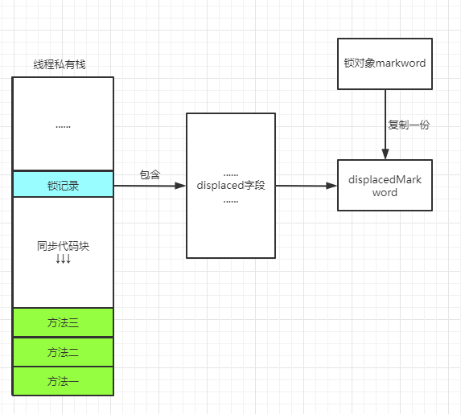
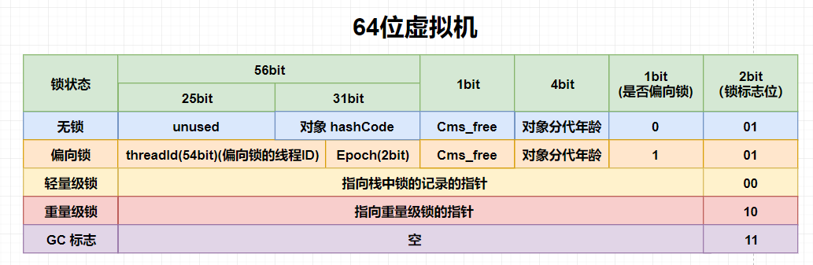
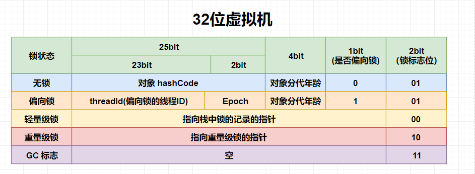

#### 以下内容需要知道的一些字段的位置

理解下来大致位置如下：

- **各种名词对应位置**

- **64位虚拟机中的 markword**

- **32位虚拟机中的 markword**

#### 什么是 Synchronized 偏向锁？

是一种锁的状态，拿情况来说明，可能会更好说明这个状态：

**`synchronized`** 同步代码块其实很多情况下，都不一定是多个线程要运行，甚至基本上只有一个线程运行，虽然基本上只有一个线程运行，但由于我们为了防止可能发生抢占情况，为了程序的健壮性，还是得用 **`synchronized`** 来修饰这个代码块，但是 JDK6之前的是重锁，成本太大。

#### 说一说JDK6 提出的偏向锁有哪些优势？

**如果没有偏向锁，那么锁的状态直接就从无锁到轻量级锁了，直接使用轻量级锁，甚至如果没有轻量级锁，就直接会到达重量级锁状态，他会有一定的损耗**，因为轻量级锁加锁解锁都需要 CAS 操作，而偏向锁就不需要修改对象头的 **`markword`**，少一次 CAS 操作。

#### 那么偏向锁加锁的流程是什么？

 当我们使用 **`synchronized`** 对象锁定某个对象的时候，如果这个锁处于匿名偏向状态，也就是 64位状态下，**`markword`** 的二进制数中，表示偏向线程的比特位是0，并且锁状态位表示的是偏向锁状态，这个时候线程获取锁时实际是直接在锁对象的 **`markword`** 高位内存储当前线程内存地址（使用 **CAS** 比较并交换完成），如果设置成功，那么这把锁就是当前线程的偏向锁了，也就是偏向当前线程的锁。

获取锁的成本特别低，基本上就是两个步骤：

1. 向当前线程栈内添加一条锁的记录，让锁记录中的锁标识指向当前锁对象，这一步不存在并发问题，不需要用 **CAS** 操作
2. 通过 **CAS** 设置锁对象的 **`markword`** ，存储当前锁偏向的线程地址。

JAVA6和7，偏向锁默认启用， 如果确定程序的锁在通常情况下处于竞争状态，可以关闭偏向锁。

偏向锁没办法提供线程互斥，为什么要引用他这个锁呢？下一问会回答：

#### 所以某个线程获取到锁对象的偏向锁之后，执行完同步代码块，会释放这个偏向锁吗？有什么优势？

接上问：**退出代码块对应的字节码指令是两个 `monitorexit`**， 然后 JVM 处理这个指令的时候：

1. 将当前线程栈内与当前锁对象相关的锁记录全部拿到
2. 将最后一条锁记录释放
3. 检查锁对象的 **`markword`**
   - 如果当前锁对象是偏向状态，啥也不做，完事。

也就是说，**好处就是**，提出偏向锁，来减少开销，并且释放偏向锁的时候，不会把上一次持有这个偏向锁的线程ID给抹除，而是继续保留，那么下一次同一个线程运行想要得到这个偏向锁，那就直接进行一次比对，就可以了，不涉及 CAS 操作，大大减少了资源的消耗，也就是**偏向锁状态时可重入锁的原因**。

#### 使用偏向锁是不是一定就会提升性能？

接上问，真不一定，实际情况下锁对象只会被一个线程获取释放，获取释放。。。这样的话，偏向锁的性能消耗并没什么，但是条件稍微苛刻一点，比如说某个锁对象，之前被线程 A 获取过，它的锁状态是偏向线程 A的，但是如果此时多一个 B 线程也要获取这个锁对象，那么就会触发锁升级逻辑，他们就是这么设计的，没办法，锁升级是很消费性能的，因为要检查很多锁的状态来保证正确性。

所以说，如果没有偏向锁的存在，这块锁升级过程可以避免，但是随之而来的问题就是，失去了某些情况下，我们一个同步代码块很可能只有一个线程运行，但是如果直接是轻量级锁，那么代价就变大（**说一说JDK6 提出的偏向锁有哪些优势？这一问中的情况**）。

#### 那么偏向锁会主动释放吗？什么时候释放？

上面我们也总结过偏向锁的优点，就是，可重入，对于一个线程它没有 CAS 比较，所以，它不会主动释放，因为，**锁对象 `markword` 中记录的锁偏向的ID在没有进入到轻量级锁状态时，记录的都是当前这一个线程的ID**。

偏向锁的撤销，==是被动的==，必须要在**`其它线程`**尝试竞争偏向锁并且要等到**拥有这个偏向锁的线程达到全局 safepoint 安全点（也就是这个时间点上没有字节码在执行的状态）并且，进一步去检查持有该偏向锁的线程是否处于活动状态**：

- 不处于活动状态，则将锁对象的 **`markword`** 中的锁状态设置为**无锁（unused）**
- 如果仍处于活动状态，拥有偏向锁的线程的栈会被继续执行（判断是否需要在次持有锁），遍历偏向线程的锁记录，查看锁的使用情况：
  - 如果还需要持有偏向锁，并且现在其它线程也在争夺，那么情况就升级为轻量级锁。
  - 如果不需要了，那么就将锁对象恢复成无锁状态。
- 最后唤醒暂停的线程。

#### 那么什么是 safepoint 呢？介绍一下呗

**JVM** 出现这个状态的时候，所有线程都处于 “阻塞” 状态，也就是说不能再向下处理程序了，也就是 线程的私有栈和共享的堆内存，在 **`safepoint`** 时，处于冻结状态（非完全冻结），此时后台只有 **VM 线程**处于运行状态。

VM 线程它可以执行一些特殊的任务，例如 Full GC 任务，撤销偏向锁等等。

#### 那么为什么撤销偏向锁要在安全点内执行呢？

因为偏向锁撤销的过程中啊，会修改尺有所的线程的栈数据，如果不在安全点内执行，会有并发问题。

所以总结一下是因为**撤销操作可能会操纵当前持锁线程的栈，所以必须得在安全点内执行**。

#### 什么是 Synchronized 轻量级锁？

我觉得它也是一种场景带来的名字，一种状态的概括，概念应该不好描述，为什么出现它，感觉就很好的解释了什么觉轻量级锁。

作用场景就是：**并发环境下，多个线程，交替执行一个同步代码块**。

轻量级锁，它最重要的一点就是，它依旧解决不了线程竞争的问题，它不提供线程的**互斥性**！

#### 为什么引入轻量级锁？

那么轻量级锁就是，出现的场景吧，就是可能一个临界资源有不同的线程在进行访问，但是绝大多数情况下，并行并不多见，几乎都是线程轮番获取。

在这种情况下，我们如果，没有轻量级锁，那么会直接从偏向锁状态升级为重量级锁，提前创建 **`monitor`** 对象，这样的话系统开销就大了，创建重量级锁应该是等到实在没有办法看，确实有很多线程并行的情况下才去创建，注意嗷是：==**并发环境下，线程并行情况**==，所以引入轻量级锁，**可以避免过早的创建重量级锁。**

#### 无锁到轻量级锁的一个过程是怎么样的？

==一切的前提都是一个同步代码块处于并发环境中（也就是有多个线程访问）。==

同步代码块加锁对应的字节码是 **`monitorenter`** 指令（同步方法是 **`acc_synchronized`**），JVM 执行这个指令之前：

1. 第一件事就是向当前线程栈内插入一条锁记录，锁记录中的锁引用字段保存的是锁对象的地址。
2. 让当前锁对象生成一条无锁状态的 **`markword`**（学名叫做 **`displacedMarkword`**），并且让生成这个无锁状态的 **`displacedMarkword`** 值保存到当前这条锁记录的 **`displaced`** 字段内，也就是说 **JVM 会先在当前线程的栈桢中创建用于存储锁记录的空间，并将对象头中的 `markword` 复制到锁记录中**，官方称为 **`Displaced Mark Word`**。
3. 使用 CAS 操作去设置当前锁对象的 **`markword`** 中线程ID的值，修改为当前线程位该锁偏向的线程的状态。
   - 如果当前对象的 **`markword`** 就是无锁状态，那么这一步肯定会修改成功，修改成功就直接将**无锁状态变为偏向锁状态**了，==但是它处在并发环境中！所以我们可以默认此时已经是**轻量级锁状态**了==
   - 如果已经是偏向锁状态，那么这一步就得 CAS 自旋比较（默认一般是10次），是否可以替换为当前请求锁的ID，替换成功那么当前线程就获得了锁。
4. 以上所有过程都是在需要轻量级锁情景下，会去执行的步骤，所以对应的就是轻量级锁的状态的升级过程，虽然有变成偏向锁的步骤，但是轻量级锁状态包含了偏向锁状态，在他基础上添加了步骤罢了。

其实只要出现了多个线程对一个同步代码块的交替执行操作，那么锁状态就是轻量级锁状态了，上面的三个步骤中从第二个步骤开始，就代表这个同步代码块得被不同的线程访问，所以这个过程都是轻量级锁的升级过程。

#### 轻量级锁状态时，锁重入，JVM 怎么处理呢？

首先 JVM 解析器收到字节码指令，仍然是 **`monitorenter`** 指令，在解析执行这个指令之前还是会向当前线程栈内插入一条锁记录，并且这条锁记录内的锁引用字段仍然指向这个锁对象。

还是会让这个锁对象生成一条无锁状态的 **`displacedMarkword`**，并且让当前线程栈内的锁记录的 **`displaced`** 字段保存这个 **`displacedMarkword`** 值。

使用 CAS 操作去设置当前锁 **`markword`** 的值，因为当前锁对象的 **`markword`** 值处于**轻量级锁状态**，所以这一步 CAS 操作会失败，因为它此时采用的比较的值是无锁状态时 **`markword`** 的值。

CAS 操作失败之后，当前线程会检查为什么失败：

- 首先要检查的就是**锁重入**的情况：

  - 锁对象 **`markword`** 内表示锁持有者的比特位的值指向当前线程空间的话，就说明当前线程就是这把锁现在的持有者，说明发生了锁重入的操作。

  - 锁重入了的话，我们只需要把刚刚在当前线程栈内插入的那条锁记录的 **`displaced`** 字段置空，就完事。

当前线程锁重入的次数，是**根据当前线程栈内指向该锁对象的记录的数量来统计**的，就比如说我一个线程，栈内出现了**锁引用字段**对于**同一把锁**的三条记录，这就说明有两次重入。

#### 那么锁重入后的锁退出时怎么样的？

释放锁的字节码是 **`monitorexit`**，JVM 处理这条指令的时候首先**从当前线程栈内找到目前最后一条锁引用字段指向当前锁对象的锁记录**，并且将这条锁记录的锁引用字段设置为null，这一步就是释放锁记录，由于线程栈的封闭特性，独立空间，所以这一步不需要 CAS 操作。

上一步完事之后再检查这条锁记录的 **`displaced`** 字段是否有值，如果没值，那么说明，这条锁记录是锁重入时存放的，存在锁重入情况就只需要将这条记录释放，对应逻辑就是锁记录中的锁引用字段设置为 null，这样就可以完成一次锁退出。

#### 那么轻量级锁完全释放的流程？

首先也是将当前线程栈内锁引用锁指向的当前锁对象的这条锁记录的那个引用字段设置为 null（释放锁记录），再检查这个锁记录。

因为轻量级锁或者重量级锁第一次加锁的时候在线程栈内插入的锁记路比较特殊，第一次加锁这条锁记录保存了一个 **`displacedMarkword `**的值，然后这个值对应的是无锁状态。

所以接下来当前线程把锁记录内的 **`displaced`** 值通过 CAS 的方式设置到当前锁对象的 **`markword`** 中：

- 如果在此之前，别的线程已经将锁状态升级，那么这个锁对象的 **`markword`** 就和当前线程栈中记录的 **`displaced`** 字段的值不一样，CAS 操作交换肯定失败，代表锁已经升级或者正处于膨胀状态，得走重量级锁的释放步骤了。
- 如果恰巧只到了轻量级锁的状态，CAS 操作交换成功，此时就可以完全释放成功。

#### 说到了无锁到轻量级锁，那么说说偏向锁到轻量级锁的过程是怎么样的？

假设啊，假设当前锁是处于偏向**线程 A** 的状态，换句话来说就是锁对象的 **`markword`** 内存储的对象是偏向**线程 A** 的偏向锁数据的时候，**线程 B** 来了，那么这个升级过程是怎么样的。

1. 还得从 **`monitorenter`** 这条字节码开始，**线程 B** 在执行这条指令之前，仍然是向当前线程栈内插入一条锁记录，锁记录的锁引用字段仍然是指向当前这个锁对象。
2. 检查当前锁状态，发现处于偏向锁状态，并且偏向的线程也不是**线程 B**。
3. **线程 B** 此时就会提交一个**撤销偏向锁的任务**，这个任务提交到了 **VM 线程**的任务队列中，**VM 线程**会在后台不停的处理任务队列内的任务。
4. **VM 线程**取到一个任务之后，会看当前任务是否需要在 **`safepoint（安全点，上面我们也说过）`** 状态下执行，如果需要，就等到 **`safepoint`** 时执行。
5. **VM 线程**执行撤销操作会检查 **JVM** 所有存活的线程，主要是检查当前持有偏向锁的线程，它到底是不是还活着。
6. ==前面我们也说过，持有偏向锁的线程完全退出，它仍然保留偏向状态，如果偏向锁的偏向线程此时消亡了，就好办了==。
   - **消亡**：**VM 线程**将锁对象的 **`markword`** 改为无锁状态或者匿名偏向锁状态即可。
   - **存活**：
     - 通过遍历偏向锁线程栈内的锁记录来判断，首先计算偏向线程是不是还在同步代码块内，如果仍然有一条该锁对象的记录，那就是还处于同步代码块内。
     - 否则就说明线程不在同步代码块内了。
7. **所以此时我们面对两种情况**：
   - **其一**：偏向线程已经跳出同步代码块了，但是偏向锁仍然宝留了偏向信息。
     - 与偏向对象消亡的处理一致，**VM 线程**将对象的 **`markword`** 改为无锁或者匿名偏向锁状态即可。
   - **其二**：偏向线程仍然处于同步代码块内。
     - **偏向锁**升级，升级成**轻量级锁**。
     - 遍历偏向线程的栈，找到锁记录指向当前锁对象的**第一条**记录（内存中从低到高的第一条记录，也就是初次加锁时的锁记录）。
     - 修改这条记录的 **`displaced`** 字段的数据为无锁状态的 **`markword`** 的值（锁完全释放会使用这个值）；
     - 然后修改锁对象的 **`markword`** 为**轻量级锁的状态**，**保留这条锁记录内存的地址**（也就是持锁线程的内存空间地址，看开头的 **`markword`** 图），后续可以根据这个空间位置来判断是不是当前线程持锁。
8. 到上面这一步的最后一个小分支，就完成了偏向锁到轻量级锁的升级过程