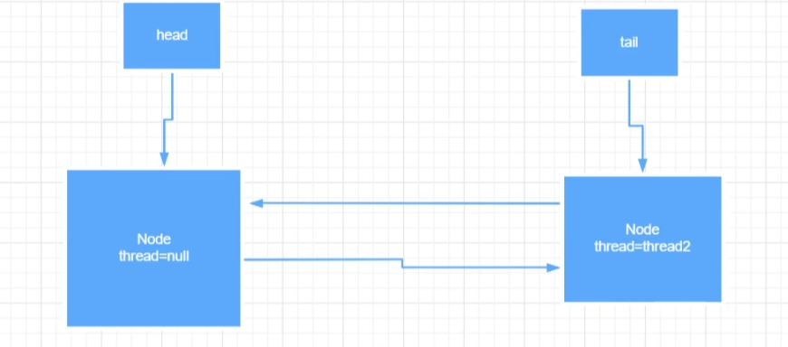

# ReentrantLock

## 公平锁情况（暂时研究它）

公平锁中的 lock 源码，**`FairSync extends Sync`** 中，公平锁的加锁是先判断是否需要排队，需要排队直接排队，不然就尝试获取锁，那么非公平锁反过来，直接去获取锁，获取到就不排队，连续两次获取失败再排队。

### lock 方法

```java
final void lock() {
    acquire(1);
}
```


### acquire 方法

```java
public final void acquire(int arg) {
    // 这个 && 有学问，如果 && 之前的内容为 false，那么就直接返回
    // tryAcquire(arg) 是重点，如果抢到锁就返回 true 加上 ！就为 false，就不执行 && 之后的逻辑，否则没抢到锁就返回 false，加上 ！ 就为 true，执行 && 之后的逻辑
    if (!tryAcquire(arg) &&
        // 没加锁成功，我们当前线程就准备加入等待队列
        acquireQueued(addWaiter(Node.EXCLUSIVE), arg))
        selfInterrupt();
}
```


### tryAcquire 方法

```java
protected final boolean tryAcquire(int acquires) {
    final Thread current = Thread.currentThread();
    int c = getState(); // 得到当前锁的状态
    if (c == 0) { // 为零则该锁未被占用
        // 当前线程获取锁
        // 当前线程判断有无别的线程正在排队等待该锁（公平，先看是否排队，再q）
        if (!hasQueuedPredecessors() &&
            // CAS 抢占锁
            compareAndSetState(0, acquires)) {
            // 设置当前线程为持锁线程
            setExclusiveOwnerThread(current);
            return true;
        }
    }
    // 如果当前锁被占用了，就判断是不是当前线程持有的
    else if (current == getExclusiveOwnerThread()) {
        // 可重入逻辑，如果重入，state ++
        int nextc = c + acquires;
        if (nextc < 0)
            throw new Error("Maximum lock count exceeded");
        setState(nextc);
        return true;
    }
    // 否则就获取锁失败，返回 false，那么在外层 ！false = true，执行 && 之后的内容
    return false;
}
```


### hasQueuedPredecessors 方法

```java
public final boolean hasQueuedPredecessors() {
    // The correctness of this depends on head being initialized
    // before tail and on head.next being accurate if the current
    // thread is first in queue.
    Node t = tail; // Read fields in reverse initialization order
    Node h = head;
    Node s;
    return h != t &&
        // 这一步，有点帅，因为我们 addWaiter 的时候，双向指针可能 node 节点没有来得及设置时间片就到了，就到别的线程了
        // 但是虽然说 node 节点没有设置后继指针，但是确实我们当前线程前面有一个线程是在排队的。
        // node <- thread1 thread2 这种情况，node 的后继指针还没来得及设置，thread2 j
        ((s = h.next) == null || s.thread != Thread.currentThread());
}
```


### addWaiter 方法

```java
private Node addWaiter(Node mode) {
    // 新建节点
    Node node = new Node(Thread.currentThread(), mode);
    // Try the fast path of enq; backup to full enq on failure
    // 可能会有并发问题，CAS 加入到 AQS 等待队列尾部
    Node pred = tail;
    if (pred != null) {
        node.prev = pred;
        if (compareAndSetTail(pred, node)) {
            pred.next = node;
            return node;
        }
    }
    // CAS 失败，执行这个入队方法
    enq(node);
    return node;
}
```


### enq 方法（挺难理解）

```java
private Node enq(final Node node) {
    // 节点不能被修改
    // 无限循环开始必须比对到成功入队才退出
    for (;;) {
        Node t = tail;
        if (t == null) { // Must initialize
            if (compareAndSetHead(new Node()))
                tail = head;
        } else {
            node.prev = t;
            if (compareAndSetTail(t, node)) {
                t.next = node;
                return t;
            }
        }
    }
}
```

假设当前线程是等待队列的第一个元素，执行完之后的结果：



**我们看到它多生成了一个 Node ，为什么要生成这个 Node 呢？**

这是因为，我们假设有一个 **thread3** 连接在 **thread2** 之后，并且 **park**，那么 **unpark** 的 **thread3** 的线程就是 **thread2**。但是图中，如果我们 **thread2** 正好是第一个入队的，那么谁在之后 **unpark** 我们的 **thread2** 呢？那就得有一个节点来专门唤醒我们的队列中正真等待并且要获得锁的节点。


我们的节点中还有一个属性叫做 **`waitstatus`**

- 该属性在这个等待队列的节点中扮演这么一个角色，如果 **`waitstatus = 0`**，说明该节点是队列的最后一个节点，如果 **`waitstatus = -1`**，说明该节点还有后继节点（还有我们该需要 unpark 的节点）。


### acquireQueued 方法

```java
final boolean acquireQueued(final Node node, int arg) {
    boolean failed = true;
    try {
        boolean interrupted = false;
        for (;;) {
            // 如果我排队排完队之后发现我是第一个
            final Node p = node.predecessor();
            // 那我再去获取一次锁，因为此时锁可能被释放了，而且我还是第一个排队的，公平锁的话，那不就是我可以直接去再次尝试获取而不是park了？
            if (p == head && tryAcquire(arg)) {
                setHead(node);
                p.next = null; // help GC
                failed = false;
                return interrupted;
            }
            // 如果再次获取锁还是获取不到，那就乖乖 park 等着吧，但是 park 之前你得先修改前驱节点的 waitstatus = -1 才可以 park（对应 if 中条件判断顺序）
            if (shouldParkAfterFailedAcquire(p, node) &&
                // 尝试暂停当前加入等待队列的节点中的线程
                parkAndCheckInterrupt())
                interrupted = true;
        }
    } finally {
        if (failed)
            cancelAcquire(node);
    }
```

```java
private final boolean parkAndCheckInterrupt() {
    // 经典 park 线程处于JVM中的 WAITING状态
    LockSupport.park(this);
    return Thread.interrupted();
}
```

