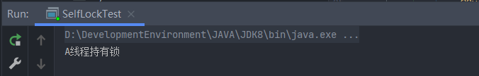

# 简单的自定义锁

我们在了解了AQS的部分源码之后，我们就可以学着 ReentrantLock 来尝试自己定义一把自定义的锁了！顺便我们来感受一下AQS提供的强大自定义支持。

## 新建并重写

阅读源码后发现所有的JUC锁都得实现Lock接口并且重写里面提供的方法，我们来照做试一试：

```java
package JUC.lock;

import java.util.concurrent.TimeUnit;
import java.util.concurrent.locks.Condition;
import java.util.concurrent.locks.Lock;

/**
 * @author noblegasesgoo
 * @version 0.0.1
 * @date 2022/7/26 11:23
 * @description 自定义锁
 */
public class SelfLock implements Lock {

    // AQS呢？
    
    /**
     * 简单的加加锁方法
     */
    @Override
    public void lock() {

    }

    /**
     * 尝试获取锁方法
     * @return
     */
    @Override
    public boolean tryLock() {
        return false;
    }

    /**
     * 尝试限时获取锁方法
     * @param time
     * @param unit
     * @return
     * @throws InterruptedException
     */
    @Override
    public boolean tryLock(long time, TimeUnit unit) throws InterruptedException {
        return false;
    }

    /**
     * 解锁
     */
    @Override
    public void unlock() {

    }

    @Override
    public void lockInterruptibly() throws InterruptedException {

    }

    /**
     * 加入condition队列
     * @return
     */
    @Override
    public Condition newCondition() {
        return null;
    }

    public static class Sync {
        
    }
}
```

## 定义内部类Sync

我们做完上述步骤之后该怎么继续做下去？因为我们尝试使用AQS做锁，那么肯定就得先将AQS引入了。

```java
// AQS呢？AQS在这呢！我们模仿 ReentrantLock 来定义一个 Sync
    private static class Sync extends AbstractQueuedSynchronizer {

        // 下面这些方法很熟悉吧

        /**
         * 尝试获取互斥锁
         * @param arg
         * @return 是否获取成功
         */
        @Override
        protected boolean tryAcquire(int arg) {

            // 使用 AQS 提供的 CAS 来尝试加锁
            if (compareAndSetState(0, arg)) {
                // 获取成功就将当前线程设置为持锁线程
                setExclusiveOwnerThread(Thread.currentThread());
                return true;
            }

            return false;
        }

        /**
         * 尝试释放锁
         * @param arg
         * @return 释放解锁成功
         */
        @Override
        protected boolean tryRelease(int arg) {
            // 线程安全释放
            // 要释放锁的话我们是不是得先看看当前锁的状态？
            if (getState() == 0) {
                
                throw new IllegalMonitorStateException();
            }

            setState(0);

            return false;
        }
    }
```

##  使用Sync

我们在重写了Sync对于AQS的一些关键方法的逻辑重写之后，我们就可以调用AQS给我们提供的模板方法来进行锁操作的定义了：

```java
private final Sync sync = new Sync();

    /**
     * 简单的加加锁方法，会循环CAS尝试
     */
    @Override
    public void lock() {
        // 调用 AQS 提供的模板方法
        sync.acquire(1);
    }

    /**
     * 尝试获取锁方法，只尝试一次
     * @return 是否获取成功
     */
    @Override
    public boolean tryLock() {
        return sync.tryAcquire(1);
    }

    /**
     * 尝试限时获取锁方法，只尝试一次
     * @param time
     * @param unit
     * @return 是否获取成功
     * @throws InterruptedException
     */
    @Override
    public boolean tryLock(long time, TimeUnit unit) throws InterruptedException {
        return sync.tryAcquireNanos(1, unit.toNanos(time));
    }

    /**
     * 解锁
     */
    @Override
    public void unlock() {
        sync.release(1);
    }

    @Override
    public void lockInterruptibly() throws InterruptedException {
        sync.acquireInterruptibly(1);
    }

    
```

## 完善

我们发现，newCondition 方法是要我们返回一个Condition对象，我们看看有没有办法去调用？我们首先想到，在Sync类中定义一个获取Condition对象的方法，然后再由外部调用即可：

```java
/**
 * 创建Condition
 * @return condition对象
*/
protected Condition newCondition() {
    return new ConditionObject();
}
```

```java
/**
* 加入condition队列
* @return condition
*/
@Override
public Condition newCondition() {
    return sync.newCondition();
}
```

## 拓展

那么我们基本功能就有了，我们可不可以加一些别的功能？我们来加一个判断当前线程是否持有锁可以不？

我们先在Sync类中来定义一个用于判断是否被锁定的方法：

```java
/**
* 判断当前是否被锁定
* @return 是否被锁定
*/
protected boolean isLocked() {
    return getState() == 1;
}
```

再在SelfLock里实现：

```java
/**
* 判断当前是否被锁定
* @return 是否被锁定
*/
public boolean isLocked() {
    return sync.isLocked();
}
```

是不是很完美。

到此为止，我们已经感受到了AQS的强大之处，也进一步给我们加深了对AQS源码的理解，最后附上所有代码：

```java
package JUC.lock;

import java.util.concurrent.TimeUnit;
import java.util.concurrent.locks.AbstractQueuedSynchronizer;
import java.util.concurrent.locks.Condition;
import java.util.concurrent.locks.Lock;

/**
 * @author noblegasesgoo
 * @version 0.0.1
 * @date 2022/7/26 11:23
 * @description 自定义锁
 */
public class SelfLock implements Lock {

    // AQS呢？AQS在这呢！我们模仿 ReentrantLock 来定义一个 Sync
    private static class Sync extends AbstractQueuedSynchronizer {

        // 下面这些方法很熟悉吧

        /**
         * 尝试获取互斥锁
         * @param arg
         * @return 是否获取成功
         */
        @Override
        protected boolean tryAcquire(int arg) {

            // 使用 AQS 提供的 CAS 来尝试加锁
            if (compareAndSetState(0, arg)) {
                // 获取成功就将当前线程设置为持锁线程
                setExclusiveOwnerThread(Thread.currentThread());
                return true;
            }

            return false;
        }

        /**
         * 尝试释放锁
         * @param arg
         * @return 释放解锁成功
         */
        @Override
        protected boolean tryRelease(int arg) {

            // 要释放锁的话我们是不是得先看看当前锁的状态？
            if (getState() == 0) {
                throw new IllegalMonitorStateException();
            }

            setState(0);

            return false;
        }

        /**
         * 创建Condition
         * @return condition对象
         */
        protected Condition newCondition() {
            return new ConditionObject();
        }

        /**
         * 判断当前是否被锁定
         * @return 是否被锁定
         */
        protected boolean isLocked() {
            return getState() == 1;
        }
    }

    private final Sync sync = new Sync();

    /**
     * 简单的加加锁方法，会循环CAS尝试
     */
    @Override
    public void lock() {
        // 调用 AQS 提供的模板方法
        sync.acquire(1);
    }

    /**
     * 尝试获取锁方法，只尝试一次
     * @return 是否获取成功
     */
    @Override
    public boolean tryLock() {

        return sync.tryAcquire(1);
    }

    /**
     * 尝试限时获取锁方法，只尝试一次
     * @param time
     * @param unit
     * @return 是否获取成功
     * @throws InterruptedException
     */
    @Override
    public boolean tryLock(long time, TimeUnit unit) throws InterruptedException {
        return sync.tryAcquireNanos(1, unit.toNanos(time));
    }

    /**
     * 解锁
     */
    @Override
    public void unlock() {
        sync.release(1);
    }

    @Override
    public void lockInterruptibly() throws InterruptedException {
        sync.acquireInterruptibly(1);
    }

    /**
     * 加入condition队列
     * @return condition
     */
    @Override
    public Condition newCondition() {
        return sync.newCondition();
    }

    /**
     * 判断当前是否被锁定
     * @return 是否被锁定
     */
    public boolean isLocked() {
        return sync.isLocked();
    }

}
```

我们可以测试一下：

```java
package JUC.lock;

import java.util.concurrent.locks.Lock;

/**
 * @author noblegasesgoo
 * @version 0.0.1
 * @date 2022/7/26 14:01
 * @description
 */
public class SelfLockTest {

    static Lock lock = new SelfLock();

    public static void main(String[] args) throws InterruptedException {

        Thread thread1 = new Thread(new Runnable() {
            @Override
            public void run() {
                testLock();
            }
        });

        Thread thread2 = new Thread(new Runnable() {
            @Override
            public void run() {
                testLock();
            }
        });

        thread1.setName("A");
        thread2.setName("B");

        thread1.start();
        Thread.sleep(1000);
        thread2.start();
    }

    public static void testLock() {

        lock.lock();

        try {
            System.out.println(Thread.currentThread().getName() + "线程持有锁");
            for (;;) {}
        } catch (Exception e) {
            e.printStackTrace();
        } finally {
            lock.unlock();
        }
    }
}

```

```shell
A线程持有锁
```

