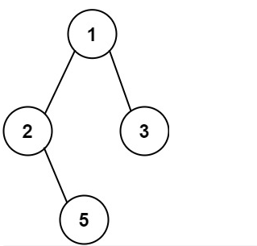

时隔好久才开始整理算法笔记了，一方面是学校琐事太多，还有就是面试太多，唉，，所以好久没有记录更新了。今天开始继续更新。

# [257. 二叉树的所有路径](https://leetcode.cn/problems/binary-tree-paths/)

```java
给你一个二叉树的根节点 root ，按 任意顺序 ，返回所有从根节点到叶子节点的路径。
叶子节点 是指没有子节点的节点。


示例 1：
输入：root = [1,2,3,null,5]
输出：["1->2->5","1->3"]
    
示例 2：
输入：root = [1]
输出：["1"]
 
提示：
树中节点的数目在范围 [1, 100] 内
-100 <= Node.val <= 100

来源：力扣（LeetCode）
链接：https://leetcode.cn/problems/binary-tree-paths
著作权归领扣网络所有。商业转载请联系官方授权，非商业转载请注明出处。
```


## 思路总结

- **简化题目描述**

首先，我们要找到一条路径，怎么想最容易？答案是递归，它需要回溯吗？要。
我们可以通过观察发现，我们要找的所有路径，就是一棵二叉树到达所有叶子节点的路径。
比如：

这个二叉树，他有两个叶子节点，所以有两条路径。
**我们的思路就开始豁然开朗了，就是找出这两个叶子节点，并且记录到达他们的路径。**


- **什么是叶子节点呢？**

**一个没有左右孩子的节点叫做叶子节点**。


- **如何来确认递归顺序？**

首先我们想到二叉树的三种递归遍历，前中后序，那么我们该选用哪一种呢？
根据前中后序遍历的特点来看，只有前序遍历满足我们的 dfs 的要求，可以一条路走到黑，所以我们就选择用前序遍历的思想来写我们的递归逻辑。

**前序遍历：一般求深度**
**中序遍历：一般求广度，排序树求排序后的节点序列**
**后续遍历：一般求树的高度**


- **回溯隐藏在哪里呢？**

其实**回溯就隐藏在 `dfs(node.left, path + "->");` 每次函数调用完，path如果依然是没有加上"->" 的，这就是回溯了。**
**因为在递归右子树之前需要还原path，所以在左子树递归后必须为了右子树而进行回溯操作。**


- **整体思路**

前序遍历二叉树找到叶子节点，并且在这途中记录路径，找到叶子节点后将其加入结果集中。


## 答案

依据上面我们所说的思路，答案就可以写成如下模样：

```java
/**
 * Definition for a binary tree node.
 * public class TreeNode {
 *     int val;
 *     TreeNode left;
 *     TreeNode right;
 *     TreeNode() {}
 *     TreeNode(int val) { this.val = val; }
 *     TreeNode(int val, TreeNode left, TreeNode right) {
 *         this.val = val;
 *         this.left = left;
 *         this.right = right;
 *     }
 * }
 */
class Solution {

    // 简单的记录结果的集合
    List<String> res = new ArrayList<>();

    public List<String> binaryTreePaths(TreeNode root) {

        // 经典特判
        if (root == null) {
            return res;
        }

        // 深度搜索
        dfs(root, "");

        return res;
    }

    // 第一个参数是当前节点，第二个参数是经过的路线
    // 前序遍历模板
    public void dfs(TreeNode node, String path) {
		
        // ------------------------------中---------------------------------
        // 如果此时这个节点是空的，那么返回，表示该方向的 dfs 结束
        if (node == null) {
            return;
        }

        // 当前节点递归没结束的话，就累加路径，这里我们累加路径分两步走
        // 第一步累加数值
        // 第二部累加 -> 号在下步
        path += node.val;

        // 如果当前节点的左右孩子节点都是空，那么就是叶子节点
        if (node.left == null && node.right == null) {
            // 所以我们直接将当前路径保存，代表深度遍历到了一个叶子节点，也就是出现了一条路
            res.add(path);
        }
        
        // ------------------------------左---------------------------------
        // 因为是前序遍历模板，所以，我们在对当前节点操作过后，再对其左右孩子做进一步操作
        // 如果当前节点不是叶子节点，那么就将它的左右孩子继续 dfs，直到找到一个叶子节点为止
        // 这里我们进行第二步字符串拼接
        if (node.left != null) {
            dfs(node.left, path + "->");
        }
		
        // ------------------------------右---------------------------------
        if (node.right != null) {
            dfs(node.right, path + "->");
        }
    }
}
```


# [404. 左叶子之和](https://leetcode.cn/problems/sum-of-left-leaves/)

```java
给定二叉树的根节点 root ，返回所有左叶子之和。

示例 1：
输入: root = [3,9,20,null,null,15,7] 
输出: 24 
解释: 在这个二叉树中，有两个左叶子，分别是 9 和 15，所以返回 24
    
示例 2:
输入: root = [1]
输出: 0

提示:
节点数在 [1, 1000] 范围内
-1000 <= Node.val <= 1000

来源：力扣（LeetCode）
链接：https://leetcode.cn/problems/sum-of-left-leaves
著作权归领扣网络所有。商业转载请联系官方授权，非商业转载请注明出处。
```

## 思路总结

这题最重要的在我看来就是**左叶子节点**这个信息，我们看到这种找到某个叶子节点，想都不用想，肯定是前序遍历来操作。

**现在问题变成了何时累加数值？**
当前节点是左叶子节点的时候累加数值。

**怎么寻找左叶子节点？**
`node.left != null && node.left.left == null && node.left.right == null`
当一个节点**它的左子节点不为空**，并且**左子节点没有左右孩子**，那么**当前节点的左子节点**就是**左叶子节点**。

## 答案

```java
/**
 * Definition for a binary tree node.
 * public class TreeNode {
 *     int val;
 *     TreeNode left;
 *     TreeNode right;
 *     TreeNode() {}
 *     TreeNode(int val) { this.val = val; }
 *     TreeNode(int val, TreeNode left, TreeNode right) {
 *         this.val = val;
 *         this.left = left;
 *         this.right = right;
 *     }
 * }
 */
class Solution {

    int res = 0;

    public int sumOfLeftLeaves(TreeNode root) {

        dfs(root);
        return res;
    }

    public void dfs(TreeNode node) {
        
        if (node == null) {
            return;
        }
		
        // ------------------------------中---------------------------------
        // 找到左叶子节点，就累加结果
        if (node.left != null && node.left.left == null && node.left.right == null) {
            res += node.left.val;
        }

        // ------------------------------左---------------------------------
        if (node.left != null) {
            dfs(node.left);
        }

        // ------------------------------右---------------------------------
        if (node.right != null) {
            dfs(node.right);
        }
    }
}
```

