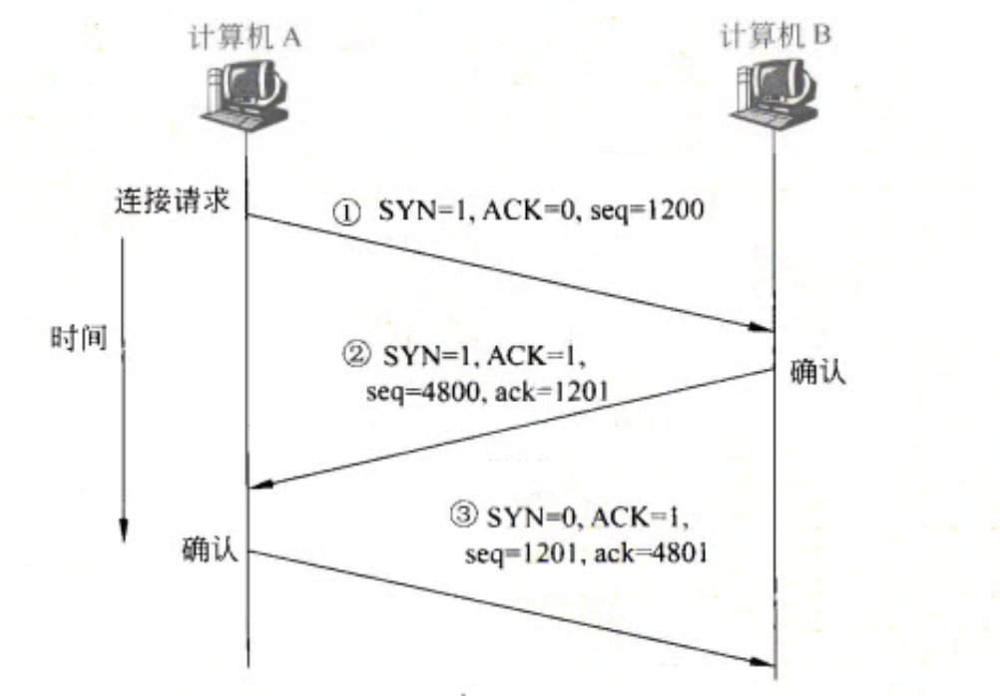
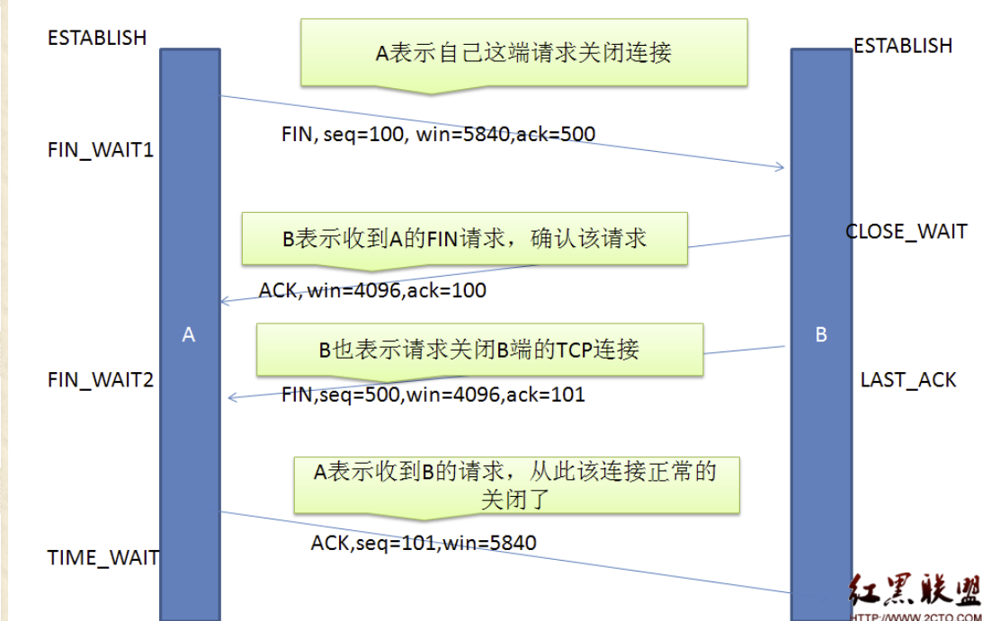

# 计算机网络常见题目复习

在看下面的内容前，我们应该学习过计算机网络，这里只是我个人复习的一个顺序，仅供参考。

## 当一个URL输入浏览器之后会发生什么事情？

1. 第一步首先绝对是进行 DNS 的解析，将一个网址变为IP地址，先查看浏览器的 **DNS** 缓存有没有对应的 **ip**，如果没有，那就去看操作系统的 hosts 文件中有没有（本地），如果操作系统本地没有的话，就像当地区域的 DNS 服务器发起查询请求，如果本地还没有，那就只能到全球13台的域名根服务器去查找了，一定找得到，否则就是找不到该网址。

   值得注意的是，**DNS** 服务器在进行区域传输的时候使用的 **TCP** 协议，其余时间是 **UDP** 协议。

2. 找到了网址对应的目标ip之后，发起 **TCP** 连接请求（三次报文握手），找到对应ip，然后 **arp** 协议将其转换成 mac 地址（数据链路层）。反正进行完这一步就是服务器与客户端就建立了连接。

3. 接下来就是处理请求，客户端与服务器建立连接之后，就开始将请求包装成报文发送 **HTTP** 请求（等下细说 **HTTP** 协议的组成）。

4. 由于 HTTP 是无连接的，服务端接收到报文，进行一系列的业务处理，之后返回给客户端然后断开连接（但是**HTTP1.0**之后有个 **keep-alive** 字段可以保持长连接），这一步就是处理与响应。

5. 关闭 TCP 连接（四次报文挥手）。

6. 浏览器渲染。

## 说一下三次报文握手和四次报文挥手吧！

首先我们来说三次报文握手：

首先第一步客户端发送标志位 **SYN（synchronous） 和 ACK（acknowledgement） 以及seq（序列号）到服务端**，请求同步（建立连接），你要给我返回确认号得是**第一段报文中的ACK + 1**，并且**SYN为我发给你的SYN**，外加确认收到我的序列号，**你得有个小 ack 确认字段 = 客户端的 seq + 1**这样我客户端才能确定你是发给我的确认报文；

第二步客户端收到了上一步客户端和服务器建立链接所需第二报文的内容，但是又多了一个**服务器的 seq（序列号）**，意思就是服务器也想说，我也来个确认，看看你有没有收到，并且我这个报文没发错人；

第三部客户端说，欸你没找错人，我就是需要 **ack = 1201 并且 SYN 和 ACK 都为一的报文**，那既然这样，我也给你回复一下我到底是不是接收到你的报文了，于是**客户端就将 SYN 置 0**，代表着连接建立成功，**ACK = 1**，代表是确认报文，然后带着自己在第二报文中获取的服务器传回的的 **seq （用来代表，我收到你的第二段报文了！）**，以及确认 **ack** 字段来确认确实是我，此时我的第三报文中的 **ack = 第二报文seq + 1**，来代表我收到了服务器的报文。

### 为什么不是二次握手？

因为为了在不可靠信道上建立可靠的连接，有可能阻塞，如果只有两次握手，那么丢失的syn包可能会滞后，在这之前客户端觉得服务器没有收到第一个阻塞的syn包，所以重发，这个新的syn包顺利到达，两次握手的话，服务端发送确认之后，就建立连接，此时这个阻塞的syn包再次到达，那么服务端又会再次给客户端发送建立连接请求。

所以为了避免这个情况，syn包阻塞重发会导致服务器创建多重连接，而客户端只接受唯一连接从而造成状态不一致，就有了三报文握手。

### 丢包问题、乱序问题？

图中展示了乱序问题和丢包问题的解决方法，他们同时可以用 ACK 字段来完成，由于TCP是全双工的，所以我们不去说是哪一方发送的问题。

## 说一下四次报文挥手？

## 挥手为什么需要四次？

因为当服务端收到客户端的 **SYN 连接请求报文**，可以直接发送 **SYN + ACK 报文**。其中 A**CK 报文**是用来应答的，**SYN 报文**是用来同步的。

如果此时第二报文就是确认断开连接报文的话，可能会造成某些数据包传送不到就关闭连接了，所以，第二报文他需要有一个缓冲时间，等待所有数据发送完毕之后再发起一个确认断开连接的报文。

到这里就有三次报文了，但是其中第二第三报文都是服务端返回的，那么这俩个报文中间间隔的这段时间就是等待剩余数据传输完毕，然后第四次报文是客户端发给服务器，表示接收到了服务端的断开请求，于是链接真正断开。

## 2MSL等待是啥状态？

首先，我们来说一下这个 MSL 到底是什么，每个 TCP 实现必须选择一个报文最大的身存时间，这个报文最大生存就是 MSL。他是任何报文段被丢弃前在网络内的最长存活时间。

## 四次挥手释放连接时，等待2MSL的意义？

设置 2MSL 的意义就在于保证客户端最后于一个 ACK 报文段能够到达服务器，完成连接关闭。因为最后这个 ACK 报文段可能会丢失，从而导致服务器一直处于 LAST-ACK 状态。服务器会超时重传这个 FIN-ACK ，接着客户端再次确认然后重置 2MSL 区间，并且重发的 ACK 报文段（之前的 ACK 报文段丢失过），只要在 2MSL 时间内，客户端服务器两者都一定有机会去获取ACK报文，获取不到也有机会重传。

## **为什么TIME_WAIT状态需要经过2MSL才能返回到CLOSE状态？**

因为网络是不可靠的，整个 TCP 连接就是建立在不可靠网络传输上的一个可靠的传输机制。由于网络不可靠，所以有可能最后一个 ACK 会丢失，所以这个 TIME_WAIT 状态就是为了我们重发可能丢失的 ACK 报文。

## 操作系统中的 AIO、BIO、NIO 分别是什么？

这个其实我觉得照我的理解是得归类在操作系统的知识，但是先这样吧：

1. **BIO**：看到这个开头字母，我们可以联想到**block，锁**，所以推断它可以叫做**同步阻塞I/O**，根据名称，我们可以很快获取它的大致信息以及作用，它首先肯定是阻塞的，也就是**处理完一个 socket 之后才能处理下一个 socket，而且是需要线程主动去询问是否有数据可取**。
2. **NIO**：看到这个开头字母，我们可以联想到no，不是，所以它叫做**同步非阻塞I/O**，根据名称，我们也可以很快的获取它的大致信息以及作用，首先它是同步的，但是是**非阻塞的，线程在读取数据时不会阻塞，而是可以提前结束当前读取的动作，先去做别的事情，而且也是需要线程主动去询问是否有数据可取**。
3. **AIO**：异步IO，他是**异步非阻塞I/O**，他在没有数据的时候不阻塞，会去先做自己做的事情，当有数据可读时，操作系统会通知给线程，并且，会将其直接准备好，这是完全异步的。

说到上面三个IO，我们大致可以分为两类：**异步和同步**。

同步I/O里面其实还有好多种，比如我们的 BIO 由于阻塞问题提出了 NIO，NIO 又因为要轮询所以会不时发起系统调用，所以又得改进；

因为总不能我们一直轮询吧？所以出现了信号驱动I/O，这个I/O会设置一个信号量，一旦有数据到达，操作系统内核就会主动告诉当前线程有数据来了，请你手动去取吧，就像你鱼竿安装了传感器，有🐟来，就会提示你收竿。这个解决办法挺好的，但是有没有可以在短时间内掉到大量的🐟呢？

所以出现I/O多路复用（这里面就深了，**select，poll，epoll**等等解决方案，之后我复习的时候会详细说说）。我们拿**select函数多路复用**的情况下，继续类比钓鱼，我们从只有**一根普通的鱼竿变成了有很多根这样的鱼竿**，所以我们接下来要做的事情就是等待这几个鱼竿中的某个鱼竿发现有🐟上钩的信号（有数据来了，因为没有信号机制，所以是得不断轮询或者直接阻塞式监听），然后再交给我们的钓鱼人收竿。再说明白点，就是多个进程的I/O都注册到一个注册器上，这个注册器会监听所有注册的I/O事件，但是，此时变为阻塞的同步了，为什么呢？因为，**我们的用户进程是得调用这个注册器，注册器才去监听，如果注册器没有，那么这个调用注册器的过程是一直阻塞的。**但是也有**非阻塞式的I/O多路复用**，我们这里只是拿 **select函数** 来做例子。

以上是**同步I/O**的说明，下面我们来说**异步I/O**：

何为异步，也就是说，按照我的理解就是，能获取到最终结果就行，可能获取到最终结果的调用不止一条，但是他们无关发生先后顺序，并且没有什么太大的联系，比如说发送邮箱验证码，和发送手机验证码，他俩可以同时进行，而不是有层级关系，所以异步这种思想，使用很广泛，我们的I/O也有和异步有关的I/O类型。

讲完异步，我们发现同步I/O的缺点也就是说，上面所说的那些同步I/O的内容，我们都可以找到一个共同的缺点：

- 无论如何，最后获取到 socket 中的数据，用户进程都是得主动去获取，而不是说通知之后我就不做事，你自己来取。

所以我们可以用快递的例子来说明，**异步I/O就是送货上门：你在家，你在边做别的事情，边等快递，快递到了，你签收就完事了。而同步I/O就是将快递送到代理点，通知你快递到了，但是你得自己去取。**

到这里这个问题我就暂时说这么多。

## TCP和UDP的区别？

UDP协议是无连接的，它直接将数据封装然后从网卡发出去就完事了，也不管目的地是哪（无状态）。所以它这种相对简单的机制就带来了性能损耗少，CPU内存资源占用远少于TCP，但是在网络传输过程中容易丢包，稳定性弱。

我们总结一下：

- 一个是基于连接一个是基于无连接（广播式）。
- **TCP**消耗的系统资源比**UDP**多。
- **TCP**相对**UDP**来说更慢一点，具有消息滞后性。
- 数据报模式与流模式。
- **TCP**保证数据的正确性，**UDP**可能会丢包。
- **TCP**保证数据的顺序，**UDP**不保证。

