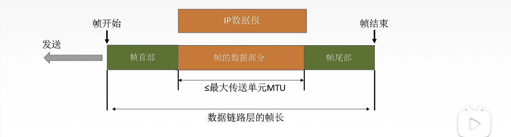

# 数据链路层的研究思想

这就是我们的5层网络协议中的层次架构。 

# 数据链路层的基本概念

下面是一个互联网络图，有三个网络，通过下面这图，我们可以得到一个基本概念：

**数据链路层**：它主要负责通过一条链路从一个结点向另一个物理链路直接相连的相邻节点传送数据报。

我们要明白几个术语：

- **节点**：上图中的主机、路由器。
- **链路**：网络中两个节点之间的**物理通道**，链路的传输介质主要有双绞线、光纤、微波登。分为有线链路和无线链路。
- **数据链路**：他是网络中两个节点的**逻辑通道**，把实现**控制数据传输协议的硬件和软件**加到链路上就构成数据链路。
- **帧**：链路层的**协议数据单元**，封装网络层的IP数据报。

# 数据链路层的主要功能

数据链路层在物理层和网络层中间提供承上启下的服务，最基本的服务就是可以将原子网络层来的数据可靠的传输到相邻节点的目标机网络层。

主要作用就是加强物理层传输原始比特流的功能，将物理层提供的**可能出错的物理连接改为逻辑上无差错的数据链路**，使物理层的数据对网络层表现为一条无差错的链路。

物理层不知道是否出错所以图中傻子会丢失文件，所以它只负责传输；数据链路层对物理层的数据进行差错检测发现少了数据（差错检测），待数据到达校验成功，封装给上级（网络层）。

- **为网络层提供服务**：
  - 无确认无连接服务，不负责，实时通信。
  - 有确认无连接服务，没有收到确认就会重传，一般用于无线通信。
  - 有确认面向连接服务，安全可靠，建立连接，互相确认。
- **链路管理**：
  - 连接的建立、维持、释放（用于面向连接的服务）。
- **组帧**。
- **流量控制**。
- **差错检测**。

# 封装成帧、透明传输

## 封装成帧

秘书B是怎么发现缺少文件了？并且还知道少了几号文件？

是因为链路层将网络层的数据报加头加尾进行了封装，这样封装后的数据报文就叫做帧，首尾部分可能是字段或者位，他们统一叫作**帧定界**（确定帧的界限，包含很多信息），其中**帧定界符**可以确定帧的界限。

**帧同步**：**接收方**应当能从接收到的二进制比特流中区分出帧的起始和终止。

我们希望帧的数据部分越多越好，但是也是有界限的，每个协议都有界限，但是界限的最大和最小都是一样的。

**组帧有四种方法**：

- 字符计数法、字符（节）填充法、零比特填充法、违规编码法。

## 透明传输

透明传输是指，**不管所传数据是什么样的比特组合，都应当能够在链路上传送**。

因此，链路层就好像“看不见”有什么妨碍数据传输的东西。

当所传数据中的比特组合恰巧和某一个控制信息完全一样的时候，就必须采取适当的措施，使接收方不会将这样的数据误认为是某种控制信息。

**换句话来说就是有时候帧首部和帧尾部可能和数据部分有一样的地方，那么这时我们不能误判首部和尾部所在位置。**

### 字符计数法

帧首部使用一个计数字段（第一个字节，八个比特位）来标明帧内字符数。

为什么会有这个痛点，是因为，如果我的第一帧的第一个帧首部此时不知道什么原因就变成4了，但是明明这一帧有5个字符，那么就会出错，而且是蝴蝶效应出错。

不常用，容易出错。

### 字符填充法

注：不同协议的SOH和EOT可能不同。

当我们传送的帧是由文本文件组成的时候（文本文件的字符都是从键盘上输入的，都是**ASCII**码）。所以**不管从键盘上输入什么字符都可以放在帧里传过去，即我们的透明传输**。

但是也可能出现这种情况，此时数据部分有字段和 EOT 相同，那么怎么判断到底是不是真的 EOT 呢？

当**传送的帧是由非ASCII码的文本文件组成时**（二进制代码的程序或者图像之类的）。就**要采用字符填充方法实现透明传输**。

所以具体字符填充法是这样解决上面的问题的：

### 零比填充充法

同样的 SOH 和 EOT 但是是固定的 0111110 来表示，数据部分也是会出现字符填充法带来的问题。

那么怎么解决呢？

- 在发送端，扫描整个信息字段，只要有连续的5个1就立即填入1个0。
- 例如：**`011011111111011111001 -> 0110111110111011111001`**。
- 在接收端接收到一个帧的时候，**先找到标志字段确定边界**，再用硬件对比特流进行扫描，发现连续5个1后就删除后面的0。
- 例如：**`0110111110111011111001 -> 011011111111101111101`**。

### 违规编码法

在物理层比特编码的时候实现透明传输，我们知道曼彻斯特编码是这样的：

因为**曼彻斯特编码中只有高低、低高两种编码法**，**高高和低低这俩种编码对于曼彻斯特编码不存在**，所以我们可以用这俩种违规的编码来定界帧的起始和终止位置。

局域网IEEE802标准就是用这种。

### 总结

由于字节计数法中count字段的脆弱性（有差错就全错）以及字符填充法实现上的复杂性和不兼容性，目前较为普遍使用的帧同步方法为零比特填充法和违规编码法。

# 差错控制

差错从何而来？概括来说传输中的差错都是由于噪声引起的。

- **全局性噪声**：由于线路本身电器特性所产生的随机噪声（热噪声），是信道固有的，随机存在的。我们的解决方法就是：提高信噪比来减少或干扰（对传感器下手）。
- **局部性噪声**：外界特定的短暂原因所造成的冲击噪声，是**产生差错的主要原因**。就像大伙都排队呢，突然一个人插进来或者过来打了某人一巴掌。解决方法：通常是用编码计数来解决。

所以差错一般分为两种：

1. **位错**：比特错，0变1或1变0。
2. **帧错**：链路层的数据传输单元出错。
   1. **丢失**：收到 [#1] [#3]
   2. **重复**：收到 [#1] [#2] [#2] [#3]
   3. **失序**：收到 [#1] [#3] [#2]

我们来回顾一下链路层为网络层提供的服务：

- **通信质量好，有线传输链路**：
  - 无确认无连接服务。
- **通信质量差的无线传输链路（采用确认和重传）**：
  - 有确认无连接服务。
  - 有确认有连接服务。

### 什么是数据链路层编码？

数据链路层编码针对的是一组比特，它通过冗余码的计数实现一组二进制比特串在传输过程中是否出现了差错。

我们一般在第一个路由器就开始纠错，这样的话避免之后每个路由器纠错浪费资源，一旦有错就先打回，然后重传。**数据链路层是两个结点间的逻辑通道，路由器和主机都是结点，它就应该实现差错控制**

数据链路层中主要是比特错，对于比特错我们有两种纠错方式：

1. **检错编码（它只是能发现错误）**：
   1. 奇偶校验码
   2. 循环冗余码CRC
2. **纠错编码（它可以知道错在哪）**：
   1. 海明码

### 什么是冗余码？

在数据发送之前，**先按照某种关系附加上一定的冗余位**，构成一个**符合某一规则的码字**后再发送。

**当要发送的有效数据变化时，相应的冗余位也随之变化**，使**码字遵从不变的规则**，接收端根据收到码字是否符合原则，从而判断是否出错。

## 检错编码

### 奇偶校验码

这题是奇校验，所以我们的校验冗余码就得在原数上添加1，来保证有奇数个1，**`1100101 -> 11100101`**。所以选择 D。

特点：

- 只能检查出奇数个比特错误，检错能力为50%。

### 循环冗余码CRC

**`最终发送数据 = 要发送的数据 + 帧检验序列FCS`**

**【说明】**“模2除法”与“算术除法”类似，但它既不向上位借位，也不比较除数和被除数的相同位数值的大小，只要以相同位数进行相除即可。

在数据链路层我们仅仅使用了CRC差错检测计数，只能做到对帧的无差错接收，即**凡是接收端数据链路层接收的帧，我们都能以非常接近1的概率认为这些帧在传输过程中没有差错产生**。接收端丢弃的帧虽然收到了，但是最终还是因为有差错被丢弃。**凡是接收端数据链路层接收的帧均无差错。**

链路层使用CRC检验，能够实现无比特差错的传输，但因为我们有些帧被丢弃了，还没对这些被丢弃的帧进行处理，所以这还不是可靠传输。**可靠传输就是指数据链路层发送什么，接收端就接收到什么。**

## 纠错编码

一般都是指海明码，这里不展开详细赘述。

# 流量控制和可靠传输

## 链路层的流量控制

较高的发送速度和较低的接受能力不匹配，会造成传输出错，所以接收方控制发送方的发送速率，我们也可以看出流量控制是多么重要。

**数据链路层的流量控制是点对点的，传输层的流量控制是端到端的**。

- 链路层的流量控制手段：接收方收不下就不回复确认。
- 传输层流量控制手段：接收端给发送端一个窗口公告，告诉别发太多。

## 停止等待协议

每发送完一个帧就停止发送，等待对方确认报文到达，收到确认之后再发送下一个帧。

发送窗口大小 = 1，接收窗口大小 = 1；

## 滑动窗口协议

滑动窗口是先将发送窗口内所有帧按序发送，等接受到接收方的确认帧后才移动窗口，这明显比停止－等待快.。

它主要解决了流量控制（收不下就不给确认，想发都发不了），可靠传输（发送方自动重传）。

### 后退N帧协议（GBN）

GBN在接收窗口收到一个帧之后就向后滑行。

发送窗口大小 > 1，接收窗口大小 = 1；

### 选择重传协议（SR）

发送窗口大小 > 1，接收窗口大小 > 1；

这三个东西之后再细讲。