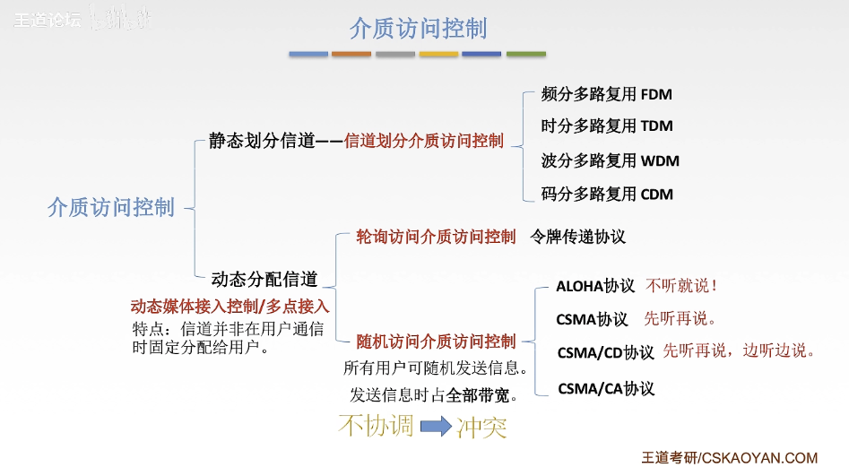
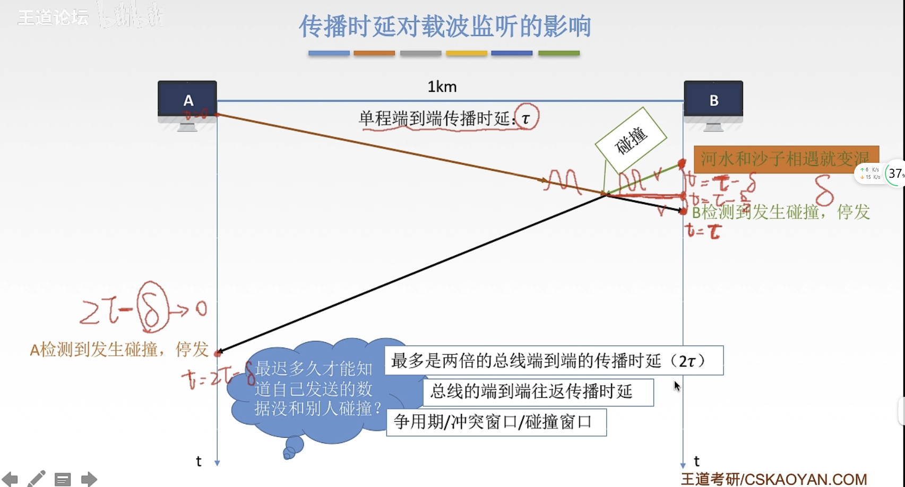
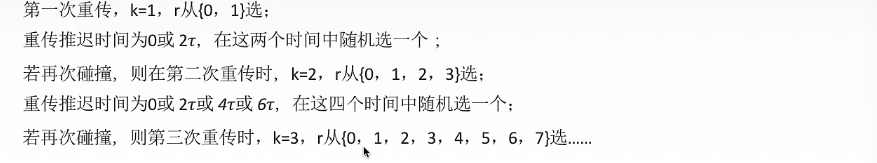
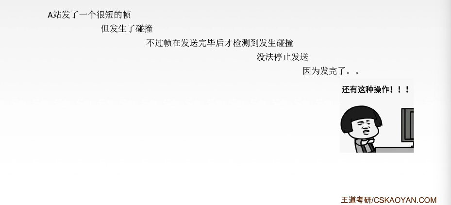

# 介质访问控制

我们主要来说明**CSMA/CD**协议，它先监听信道，然后在合适时机发送，但是会一边发送数据一边监听信道，一但发生冲突就回退。这样就不用说是我全部数据发出去再看有没有冲突，而是边发送边监听，这样节省了带宽。

# CSMA/CD协议

载波监听多点接入/碰撞检测

- **CS**：载波监听，每一个站再**发送数据之前**以及**发送数据时**都要检测一下总线上是否有其它计算机在发送数据。

- **MA**：多点接入，表示许多计算机以多点接入的方式连接在一根总线上。**也就说明我们CSMA/CD协议应用在总线型网络上**。

- **CD**：碰撞检测，“**边发送边监听**”，适配器**边发送数据边检测信道上信号电压的变化情况**，以便判断自己在发送数据时其它站是否也在发送数据。也**就说明我们的CSMA/CD协议用于半双工网络上。**

  

**先听后发为什么还会出现冲突问题捏？**

- 因为电磁波在总线上总是以有限的速率传播的。

# 传播时延对载波监听的影响

**此时信号还没到B端，B端监听信道没信号，以为此时信道空闲，然后B也发送，就出现下面的冲突了。**

只要经过2套的时间还没检测到碰撞，那么就没法生碰撞。

# 如何确定碰撞后的重传时机？

我们在发生碰撞之后，都得有一个叫停发送的动作，就像上图，A、B发生信号碰撞，那么他俩发送的这些消息，就暂时全部失效。那么接下来怎么去重传这些失效数据呢？

## 截断二进制指数规避算法

1. 确定基本退避（推迟）时间为争用期 **2套**。
2. **定义参数 k** ，它等于重传次数，但是 **k** 不超过 10，也就是  **`k = min[重传次数，10]`**，当重传次数不超过10次时；当重传次数大于10的时候，**k** 就不再增大而是一直恒定为10。
3. 从**离散的整数集合[0,1,...,2^k - 1]** 中随机取出一个数 r，重传所需要退避的时间就是 r倍的基本退避时间，也即 **`2r套`**。
4. 当**重传达16次仍然不能成功的时候，说明网络此时状态拥挤**，认为此帧永远无法正确送出，抛弃此帧并向高层汇报出错。

我们来模拟一下：

我们**可以发现若连续多次出现冲突，就表明当前可能有较多的站参与了信道的争用**，使用此算法可以使得重传需要推迟的平均时间随重传次数的增大而增大，因而减少发生碰撞的概率，有利于整个系统的稳定。

# 最小帧长问题

帧太短，导致检测到碰撞之前就已经发送完毕了，所以为了避免这种情况，我们得确定帧的最小长度，这个最小长度一定得在发送到达之前就可以检测到碰撞。

所以我们帧的传输时延至少要**两倍于信号在总线中的传播时延（2套）**。

**以太网规定最短帧长为64B，凡是长度小于64B的都是由于冲突而异常终止的无效帧。**如果不够，一般情况下就会填充。

