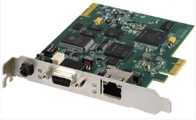
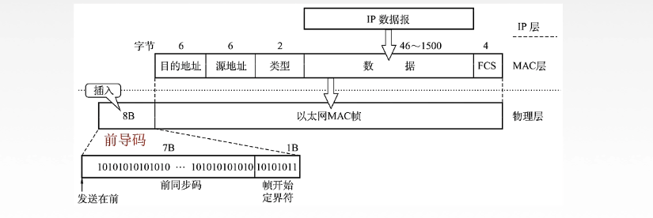

# 高速以太网

我们把速率 >= 100Mb/s 的以太网称为高速以太网。

## 10BASE-T以太网

10BASE-T是**传送基带信号的双绞线以太网**，T表示采用双绞线，现10BASE-T采用的是无屏蔽双绞线（UTP），传输速率是 10MB/S。

它物理上采用星型拓扑结构，逻辑上总线型，每段双绞线最长为100m。

采用曼彻斯特编码，一个bit对应2个码元，一个bit内有两次信号变化。

采用 **CMSA/CD** 介质访问控制机制协议。

支持全双工和半双工，**可在全双工方式下工作实现无冲突**。

## 吉比特以太网

在光纤或者双绞线上传送 **1Gb/s** 信号。支持全双工和半双工，可在全双工方式下工作而无冲突。

## 10吉比特以太网

10吉比特以太网在光纤上传送**10Gb/s**信号，**只支持全双工**，无争用问题。

# 适配器和MAC地址

计算机与外界有局域网的连接是通过**通信适配器**的。**适配器**能够把我们的计算机和外界的局域网连接起来。

网络接口板，也叫网络接口卡（NIC）一般都叫网卡，但是现在我们都不再使用单独的网卡了，现在的计算机主板上一般都已经嵌入了适配器。

**适配器上装有**：处理器和存储器（包括**RAM**和**ROM**）。

- 我们的**MAC**地址就处于**ROM**上。
- 在局域网中，硬件地址又称为物理地址，或者**MAC**地址。

## MAC地址

每个适配器，他都有一个全球唯一的48位二进制地址，**前24位代表厂家（由IEEE规定的）**，后24位厂家自己指定。常用6个十六进制数表示，比如**`03-70-8c-e4-b1-20`**。

# 以太网的MAC帧

- **前导码：由前同步码和帧开始定界符组成，不算MAC帧的真实部分。**
  - 前同步码：使发送方和接收方进行时钟同步。
  - 帧开始定界符：真实头部。
- **目的地址**：接收方的地址。
  - **单播地址**：专有的 MAC地址。
  - **广播地址**：全一，FFFFFFFF，会发送给所有主机。
  - **多播地址**
- **源地址**：发送放的地址。
- **类型**：说明上层网络层使用的是什么协议。
- **数据部分**：**46字节-1500字节**，链路层**最大数据传送单元 MTU = 1500字节**，那么**46字节**怎么来的？我们**以太网中最小帧长是64字节**，**`46 = 64 - 6 - 6 -2 - 6`** 。数据部分有**46字节**的话，再加上源地址、目的地址之类的，就正好64字节或者更多，这样就可以使用**CSMA/CD协议**。
- **FCS**：CRC。

