# TCP连接管理

## 三次报文握手

首先我们来说三次报文握手：

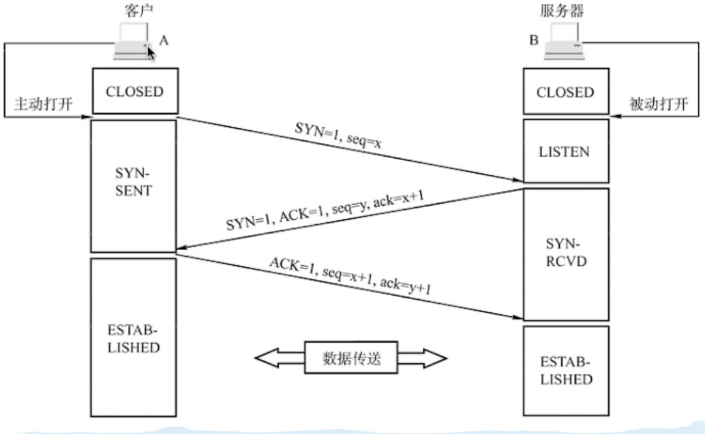

首先第一步客户端**发送连接请求报文段**，报文中有标志位 **`SYN（synchronous）= 1 、seq（序列号）= x（随机，浪费一个位）`**。请求同步（建立连接），该报文没有应用层数据传输，只起到请求建立连接的作用。

第二步服务器端在收到建立连接请求报文段后得回应，该报文段就是确认连接报文段，报文中有标志位 **`SYN（synchronous）= 1 、ACK（acknowledgement）= 1、seq（序列号）= y（随机，浪费一个位）、ack（确认序列号）= x + 1（期待对方接下来发送的报文段的第一个字节，seq字段携带的内容）`**，wei服务器端为该 TCP 连接分配缓存和变量，过程中没有应用层数据传输。

值得注意的是，我们也可以将第二部的报文拆开成2个报文，进行四次报文握手也行。

第三步正式建立连接，在客户端收到确认报文后，再次响应服务器，这样才能算作是连接建立成功，**此时的报文可以携带应用层数据**，客户端为该 TCP 连接分配缓存和变量，报文段内容 **`ACK（acknowledgement）= 1、seq（序列号）= x + 1（回应上一报文的ack字段）、ack（确认序列号）= y + 1（期待对方接下来发送的报文段的第一个字节，seq字段携带的内容）`**。

### SYN洪泛攻击？

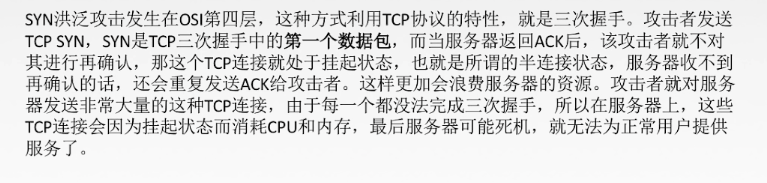

### 为什么不是二次握手？

因为为了在不可靠信道上建立可靠的连接，有可能阻塞，如果只有两次握手，那么丢失的syn包可能会滞后，在这之前客户端觉得服务器没有收到第一个阻塞的syn包，所以重发，这个新的syn包顺利到达，两次握手的 话，服务端发送确认之后，就建立连接，此时这个阻塞的syn包再次到达，那么服务端又会再次给客户端发送建立连接请求。

所以为了避免这个情况，syn包阻塞重发会导致服务器创建多重连接，而客户端只接受唯一连接从而造成状态不一致，就有了三报文握手。

### 丢包问题、乱序问题？

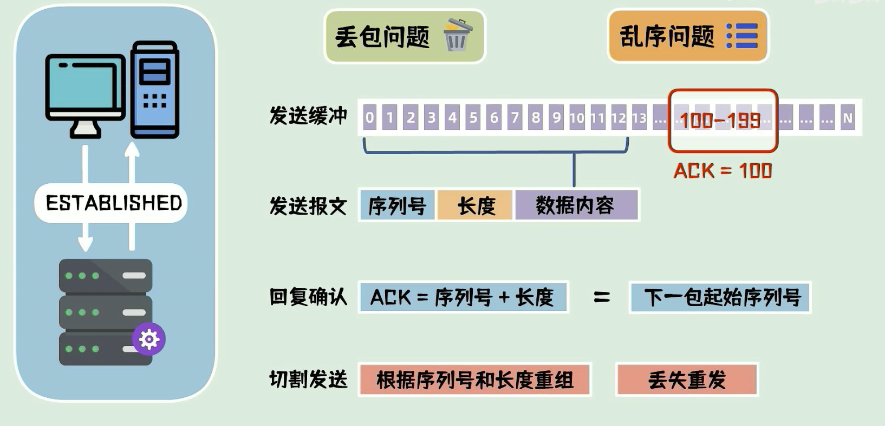

图中展示了乱序问题和丢包问题的解决方法，他们同时可以用 ACK 字段来完成，由于TCP是全双工的，所以我们不去说是哪一方发送的问题。

## 四次报文挥手

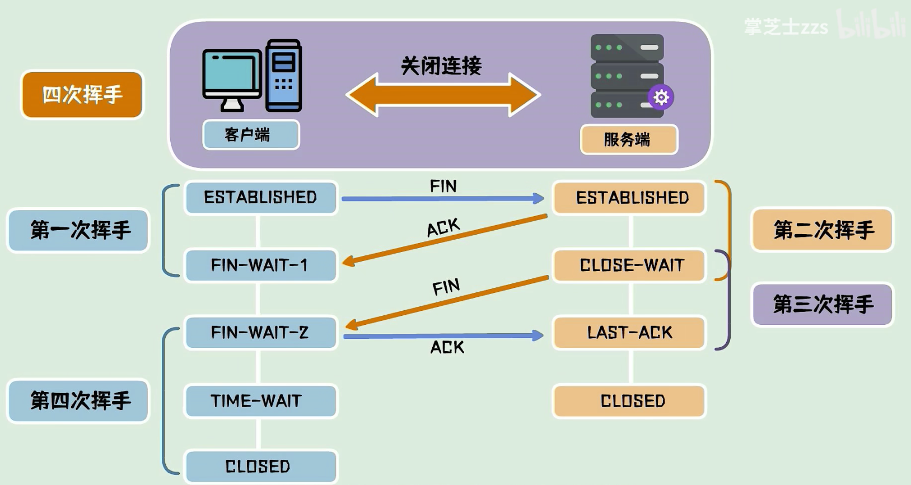

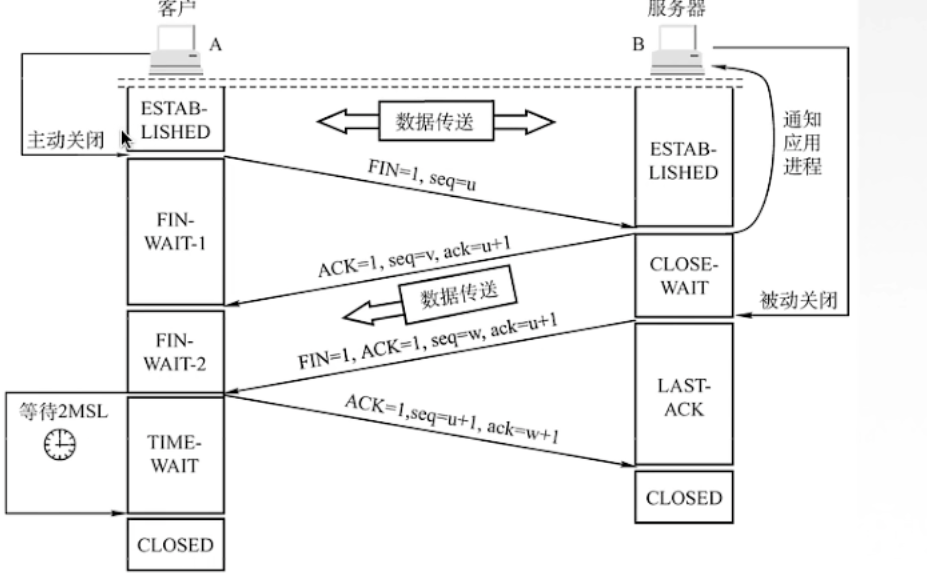

第一步就是客户端主动发起连接释放报文段，客户端发出该报文段之后就停止数据传输。主动关闭TCP连接，该报文段中标志位 **`FIN = 1，seq = u`**。FIN 表面这是一个终止连接报文。

第二步，服务器端在获取到连接释放报文之后，回应一个确认报文段，该报文段标志 **`ACK = 1，seq = v（取决于之前发送到哪里，比如shang），ack = u + 1（返回的是对上一个报文段的确认，期待客户下一次发送第一个字节为 u-1 的报文）`**；之后继续进行剩余的服务端到客户端的数据传输，半关闭状态。

第三步，服务端到客户端的剩余数据传输完毕之后，发送自己的连接释放报文，该报文 **`FIN = 1，ACK = 1，seq = w，ack = u + 1`**。

最后一步客户端返回一个确认报文，确认收到了服务器端的释放连接请求报文，服务器端收到就关闭连接，客户端则在该报文段发出之后等待 2MSL 时间才关闭连接。

### 挥手为什么需要四次？

因为当服务端收到客户端的 **SYN 连接请求报文**，可以直接发送 **SYN + ACK 报文**。其中 A**CK 报文**是用来应答的，**SYN 报文**是用来同步的。

如果此时第二报文就是确认断开连接报文的话，可能会造成某些数据包传送不到就关闭连接了，所以，第二报文他需要有一个缓冲时间，等待所有数据发送完毕之后再发起一个确认断开连接的报文。

到这里就有三次报文了，但是其中第二第三报文都是服务端返回的，那么这俩个报文中间间隔的这段时间就是等待剩余数据传输完毕，然后第四次报文是客户端发给服务器，表示接收到了服务端的断开请求，于是链接真正断开。

### 2MSL等待是啥状态？

首先，我们来说一下这个 MSL 到底是什么，每个 TCP 实现必须选择一个报文最大的身存时间，这个报文最大生存就是 MSL。他是任何报文段被丢弃前在网络内的最长存活时间。

### 四次挥手释放连接时，等待2MSL的意义？

设置 2MSL 的意义就在于保证客户端最后于一个 ACK 报文段能够到达服务器，完成连接关闭。因为最后这个 ACK 报文段可能会丢失，从而导致服务器一直处于 LAST-ACK 状态。服务器会超时重传这个 FIN-ACK ，接着客户端再次确认然后重置 2MSL 区间，并且重发的 ACK 报文段（之前的 ACK 报文段丢失过），只要在 2MSL 时间内，客户端服务器两者都一定有机会去获取ACK报文，获取不到也有机会重传。

### **为什么TIME_WAIT状态需要经过2MSL才能返回到CLOSE状态？**

因为网络是不可靠的，整个 TCP 连接就是建立在不可靠网络传输上的一个可靠的传输机制。由于网络不可靠，所以有可能最后一个 ACK 会丢失，所以这个 TIME_WAIT 状态就是为了我们重发可能丢失的 ACK 报文。

# TCP可靠传输

- 传输层使用 TCP 实现可靠传输。
- 网络层提供尽最大努力交付，不可靠传输。

什么是可靠？

- 就是指**保证接收方进程从缓存区读取的字节流与发送方发出的字节流是完全一样的**。

## TCP 实现可靠传输的机制

### 校验机制

与UDP校验一样，发送方和接收方添加伪首部然后二进制反码求和来判断是否发生错误。

### 序号机制

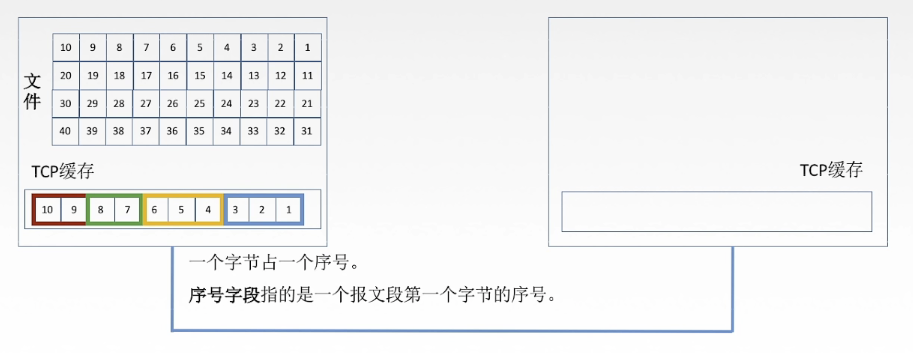

将要发送的数据进行序号编排然后有序发送。

### 确认机制

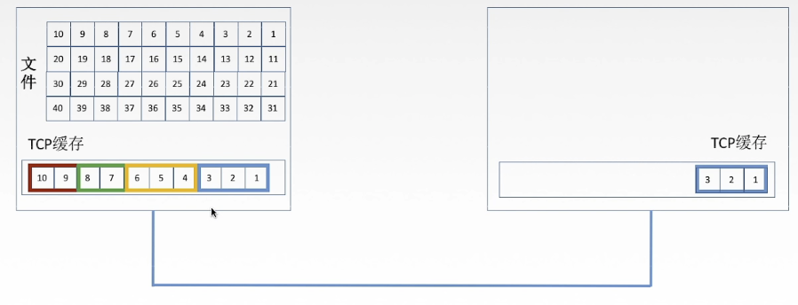

在 **1、2、3 序号**组成的报文段发送之后，发送端还会在缓存中保留**1、2、3序号**组成的原报文段，接收方在接收到之后，会在合适的时间段返回给发送端一个确认报文段来告诉接收端我收到了该报文段，你可以从你自己的缓存中删除了，**当然这个确认报文段可以携带自己要发给发送端的数据信息，一同发送。**

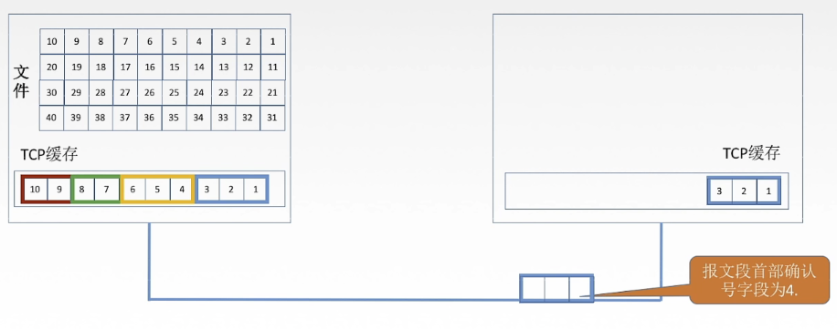

因为，如果网络过于复杂，或者网络出现问题，那么这个**1、2、3序号**组成的报文段可能丢失了，接收端就收不到该报文段，所以此时接收方应该会返回一个报文，来要求发送方重新发送一次，TCP默认使用累计确认的方式，下图 **4、5、6序号**组成的报文段丢失，即使**7、8序号**报文段到达，但是此时确认报文段首部字段仍为4。

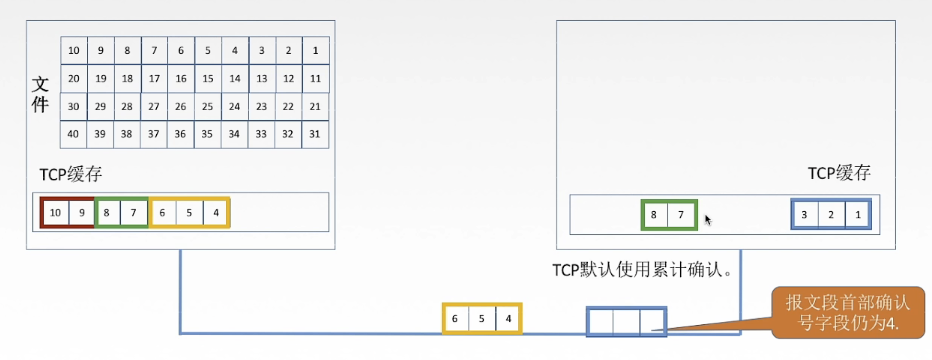

### 重传机制

#### 超时重传

确认重传应该都是不分家的，TCP的发送方在**规定的时间（重传时间）**内没有收到确认就要重传已经发送的报文段。

这个重传时间很难算，毕竟每个报文段，经过的网络环境，链路都不一样，有的快，有的慢，如果我们设置过小，那么那些传递时间长的报文会被没理由重传，使得网络负荷过大，如果设置过大，那么网络空闲可能变大。

**我们TCP采用自适应算法，动态改变重传时间RTTs（加权平均往返时间）。**

但是这样还是得等到超时时间过了才会触发，**我们有没有一种方法可以在超时前就得知报文段丢失呢？**

#### 快速重传

**有！冗余ACK（冗余确认）：当比期望序号大的失序报文段到来时，发送一个冗余ACK，指明下一个期待字节的序号，就比如上图出现的情况。**

举个例子：

- 发送方已发送**1、2、3、4、5报文段**
- 接收方接收到了**报文段1**，返回确认报文段（确认号 = 2为第二个报文段的第一个字节）。
- 接收方继续接收到了**报文段3**，返回确认报文段（确认号 = 2为第二个报文段的第一个字节）。
- 接收方继续接收到了**报文段4**，返回确认报文段（确认号 = 2为第二个报文段的第一个字节）。
- 接收方继续接收到了**报文段5**，返回确认报文段（确认号 = 2为第二个报文段的第一个字节）。
- 发送方此时**收到了3个对于报文段1的冗余ACK**。
- 发送方认为**2号报文段**丢失，重传**2号报文段**。

# TCP流量控制

流量控制：让发送方慢一点，让接收方来得及接收。

**TCP**利用**滑动窗口**机制实现流量控制。

在我们的通信过程中，**接收方根据自己接收缓存的大小**，动态的调整发送方的发送窗口的大小，也即接收窗口**rwnd**（接收方设置确认报文段的**窗口字段**来将**rwnd**通知给发送方，也就是告诉接收方我现在所能接收的报文段长度是多少），**发送方的发送窗口取接收窗口rwnd和拥塞窗口cwnd的最小值。**

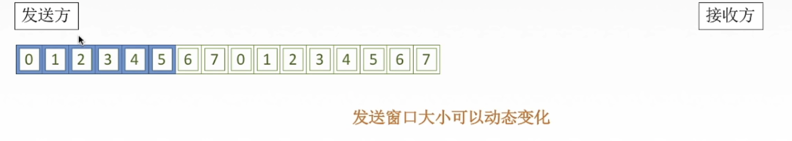

我们来看个例子，A向B发送数据，建立连接的时候，B告诉A我的rwnd=400（字节），设每一个报文段100字节，报文段序号初始值为1：

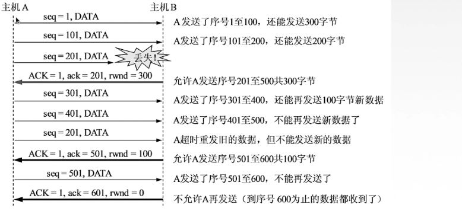

这么看来，我们是不是也有可能出现类似死锁问题？比如我接收方 rwnd 一直为 0，而发送方有数据要发送，所以我们TCP为每一个连接设有一个持续计时器，只要TCP连接的一方收到对方0窗口的通知，就启动持续计时器。

**如果此时计时器设置的时间到期，发送方就发送一个零窗口探测报文段，接收方收到探测报文段时给出现在的窗口值。**

- 此时窗口字段仍然为零的话，那么发送方就重新设置持续计时器。

一开始发的时候丢了，然后rwnd也没有了，然后超时以后就可以重发了。

# TCP拥塞控制

**出现拥塞的条件**：
			对资源需求的总和 > 可用资源（带宽、交换节点当中的处理机、缓存等）。

**网络中有许多资源同时呈现出供应不足 -> 网络性能变坏 -> 网络吞吐量将随输入负荷增大而下降。**

**拥塞控制**：
			防止过多的数据注入到网络中（全局性），协调使用网络资源的所有主机，以此减轻网络拥堵的情况。

**拥塞控制是全局性的，而流量控制（端到端）主要是限制发送方的发送速率。**一个是路上堵车，一个是目的地停车位不够。

## 拥塞控制四种算法

**假定**：

1. **数据单方向传送，而另一个方向只传送确认。**
2. 接收方总是有足够大的缓存空间，因而发送窗口大小取决于拥塞程度（**发送窗口 = Min{接收窗口rwnd，拥塞窗口cwnd}**）。

- **接收窗口**：**接收方**根据接收缓存设置的值，并告知发送方，反映接收方容量。
- **拥塞窗口**：**发送方**根据自己估算的网络拥塞成都而设置的窗口值，反映网络当前容量。

==下面的所有内容都是在满足以上假定的情况下==。

### 慢开始和拥塞避免

**mss是TCP数据部分最大长度，mtu是IP分组数据部分最大长度。**

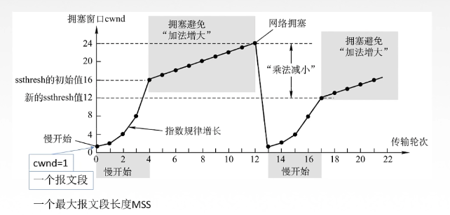

**一个传输轮次**：发送了一批报文段并收到它们确认报文的总时间，也就是**一个往返时延RTT**。开始发送一批拥塞窗口内的报文段到开始发送下一批拥塞窗口内的报文段的时间。

总结下来慢开始就是先试探，慢慢增加拥塞窗口，指数到达阈值边线性探测，之后出现网络拥塞立马回到慢开始原点。

### 快重传和快恢复

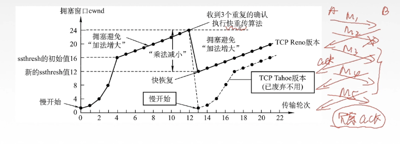

老样子先指数增长探测，之后线性增长，但是这俩算法是在收到连续的**ack**确认之后执行的，就比如发送方收到三个**冗余ack**就会执行快速重传，之后进行快恢复，**冗余ack**的特点是如果多次对某一段请求的数据没有被收到，达到一定数目之后就会立即执行重传。但是此时只是降到现在cwnd的一半，再重新线性增长。而不是像慢开始和拥塞避免的从头开始

