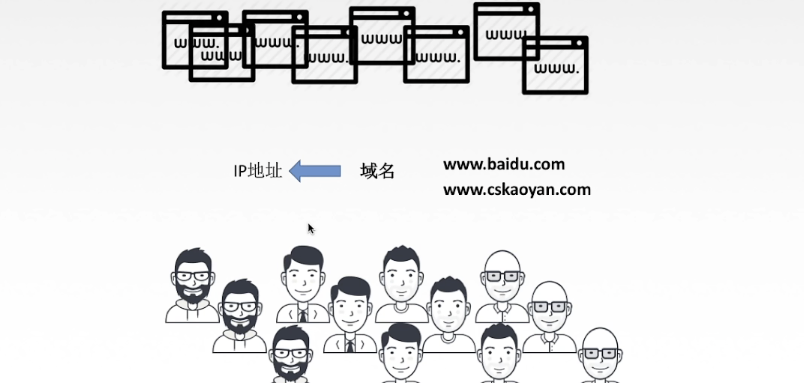
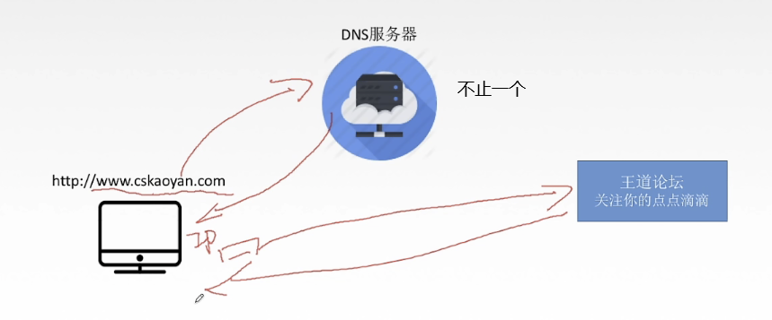
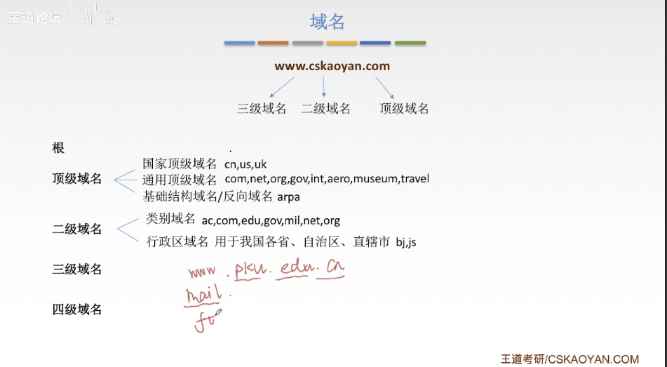
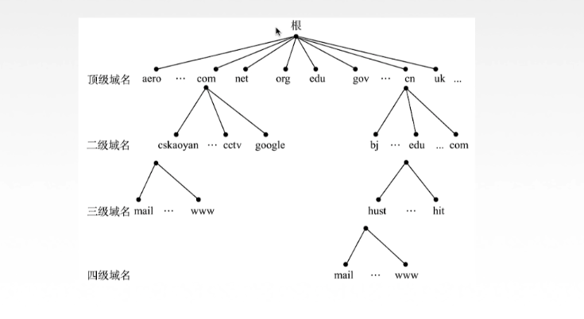
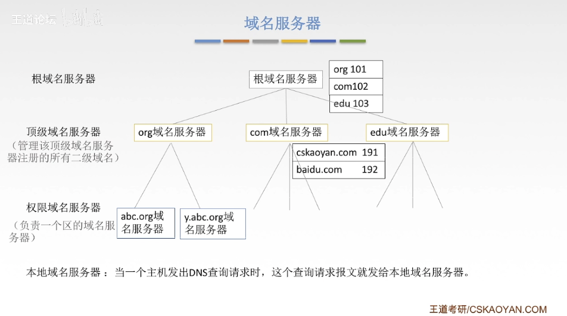
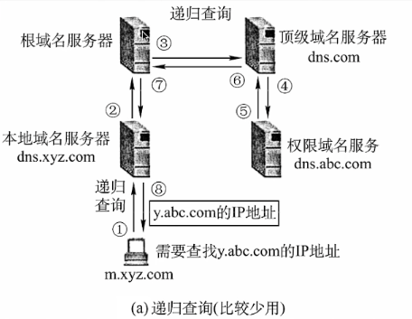
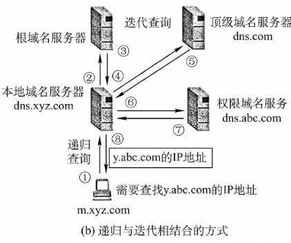

# DNS系统

我们都知道，每个ip地址都是全球独一无二的，随着我们的网站越来越多，ip地址就越来越多，并且，我们的ip地址很难记住，因为没有什么特征。所以我们有没有什么办法来记住这些难记的ip地址呢？有，那就是域名。

我们可以把域名看作是网站的名字，我们根据域名就很好记忆了。但是，**实际底层还是ip地址上对应点到点的数据交互**。现在域名有了，域名对应的ip地址谁来帮忙域名到ip地址的转换呢？

这个过程我们靠DNS服务器来完成：

由此我们也可以看出，**DNS服务器它不负责我们的点对点的数据传输，它只负责告诉我们主机对应域名所在的服务器的ip地址。**

# 域名

**`www.cskaoyan.com` 可以加上根 `www.cskaoyan.com.`**

我们通常使用域名树的形式来表示：

# 域名服务器

域名服务器当然不可能全球只有一台，如果只有一台，那么如果那台服务器宕机了，全世界的主机就无法访问网站了。

**我们一般有四种域名服务器（层级从上到下，越低离本机越近）：**

1. **根域名服务器**：知晓所有顶级域名服务器的ip地址。
2. **顶级域名服务器**：管理该顶级域名服务器注册的所有二级域名。
3. **权限域名服务器**：负责一个区的服务器。
4. **本地域名服务器（不属于层次结构的，默认域名服务器）**：当一个主机发出DNS查询请求时，这个查询请求报文就发给本地域名服务器，**它距离本机最近，所以，查询最简单，并且速度最快**。

**到权限域名服务器都找不到的话，告诉发送DNS查询请求的客户下一步该找哪个新的权限域名服务器。**

# 域名解析过程

## 递归查询

## 递归与迭代查询

